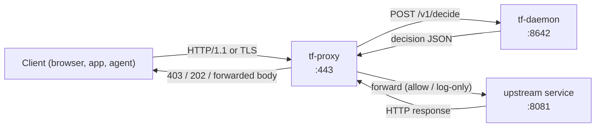

# tf-proxy

`tf-proxy` is the TrustForge enforcement reverse proxy. It sits in front of an
upstream HTTP/HTTPS service, asks `tf-daemon` whether each request should be
allowed, and forwards or denies the request based on the decision.

This crate is **experimental** and not production-ready.

## Topology



For each incoming request, tf-proxy:

1. Extracts a host token from `Authorization: Bearer ...`, or from a
   `__session=` or `__Secure-next-auth.session-token=` cookie.
2. POSTs `/v1/decide` to `tf-daemon` with `{actor, host_token,
   host_token_kind, action, target, context, trace_id}`.
3. Acts on the response:
   * `allow` — forward upstream, copy response back.
   * `deny` (enforce mode) — return `403 Forbidden` with
     `WWW-Authenticate: TrustForge realm="...", reason="..."` and a JSON
     body `{error, reason, proof_id}`.
   * `deny` (observe-only mode) — forward upstream and emit a proof-event
     log.
   * `approval-required` — return `202 Accepted` with `Location:
     <daemon>/v1/approval/<approval_id>` and `{status, approval_id}`.
   * `log-only` — forward upstream and emit a proof-event log.

WebSocket upgrade requests are decided once with action `connect`. If
allowed, tf-proxy splices the client and upstream TCP streams together so
the upgrade and subsequent frames flow transparently.

## Install

Build from source:

```bash
cargo build -p tf-proxy --release
```

The binary lands at `target/release/tf-proxy`.

## Usage

```bash
tf-proxy \
  --listen 0.0.0.0:8080 \
  --upstream http://127.0.0.1:8081 \
  --daemon http://127.0.0.1:8642 \
  --profile tf-home-compatible \
  --mode enforce
```

CLI flags:

| Flag | Default | Purpose |
| --- | --- | --- |
| `--listen` | `0.0.0.0:8080` | Address to bind for client connections. |
| `--upstream` | _required_ | Upstream service base URL. |
| `--daemon` | `http://127.0.0.1:8642` | tf-daemon base URL. |
| `--admin-token` | env `TF_ADMIN_TOKEN` | Sent as `X-Admin-Token` header to the daemon. |
| `--profile` | `tf-home-compatible` | Profile name advertised in proof events. |
| `--mode` | `observe-only` | Either `observe-only` or `enforce`. |
| `--tls-cert` | _none_ | PEM cert path. Requires `--tls-key`. |
| `--tls-key` | _none_ | PEM key path. Requires `--tls-cert`. |

Set both `--tls-cert` and `--tls-key` to terminate TLS at the proxy. The
proxy decrypts inbound traffic, runs the same decision logic, and forwards
plaintext to the upstream.

## Testing

```bash
cargo test -p tf-proxy
```

The tests bring up a mock tf-daemon and a mock upstream and drive the
proxy via `reqwest`.
