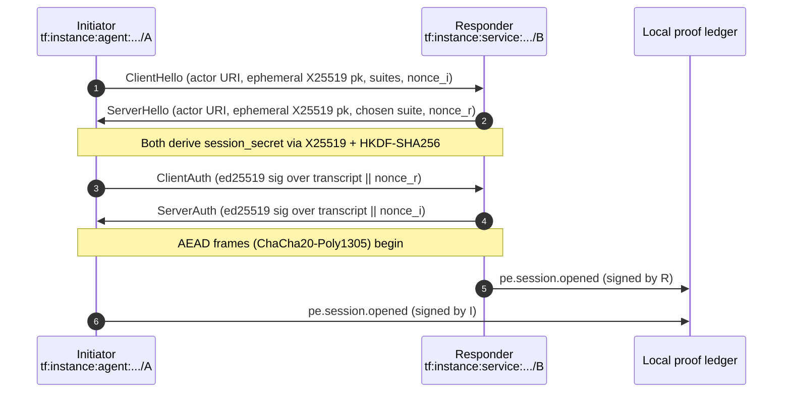
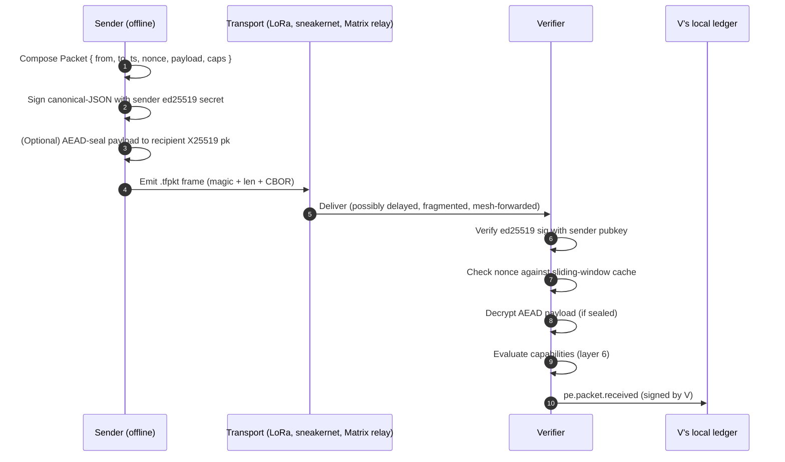
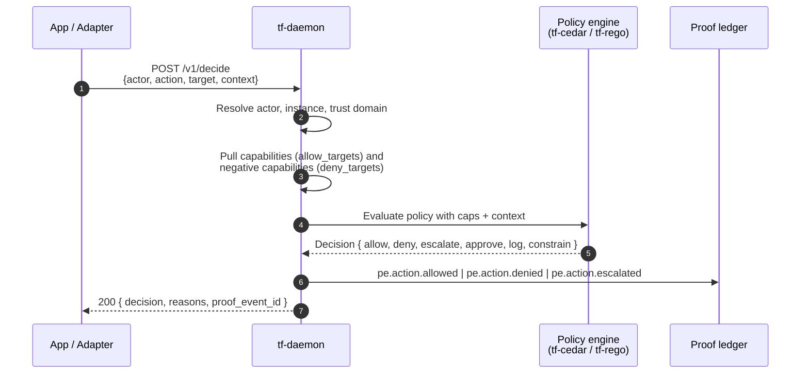
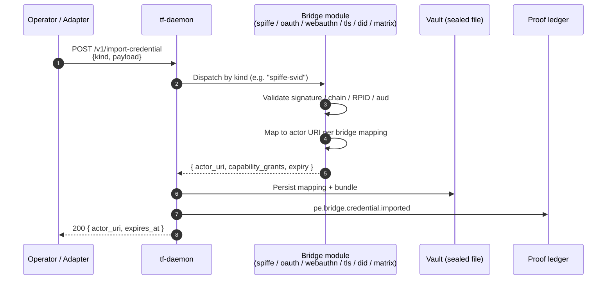
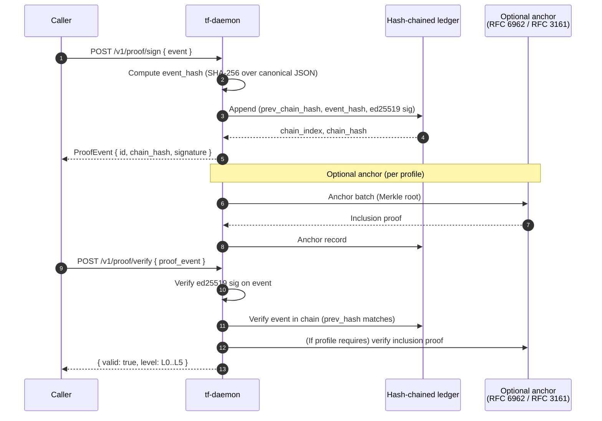
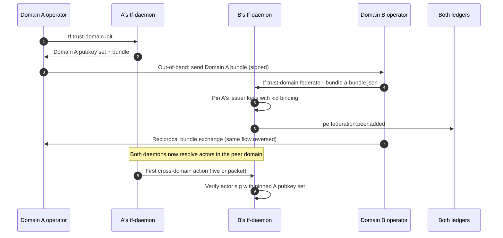
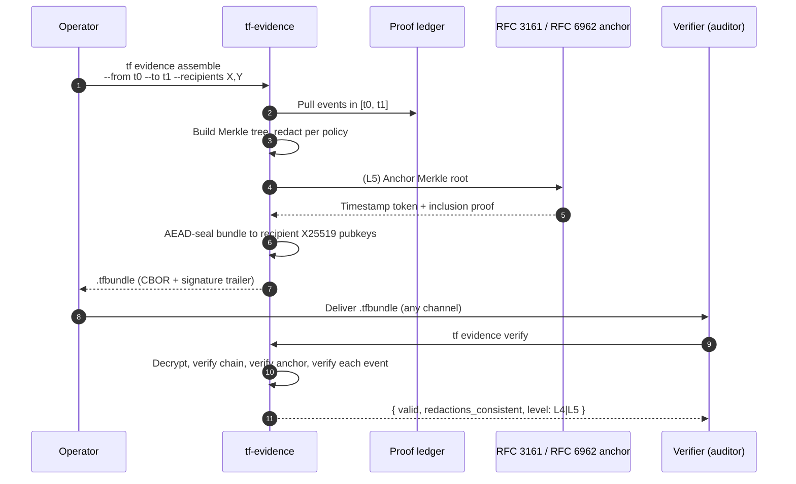
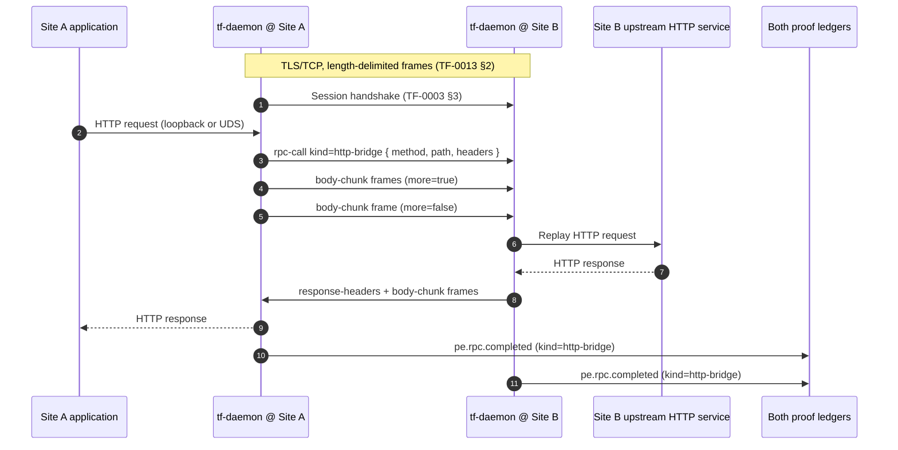

# Data flows

This page documents every major flow that crosses a TrustForge
boundary. For each flow it shows the actors, the messages, the
signing keys involved, and the proof event(s) emitted. Layer numbers
refer to the 12 layers in
[`system-overview.md`](system-overview.md).

The flows are presented in dependency order: identity first, then
sessions, then policy, then proof, then federation, then evidence.

## Flow A — Live mode handshake

Layers exercised: 1, 2, 3, 4, 9. Spec:
[TF-0003 §3](../specs/TF-0003-proofwire-transport.md). Code:
`crates/tf-session/`, `tools/tf-session/`,
`tools/tf-daemon/src/session/`.

Signed material:

- ClientAuth and ServerAuth sign the running transcript hash (SHA-256
  over canonical-JSON of every prior frame) plus the peer's nonce.
  This is the layer-4 binding between actor identity and key exchange.
- The transcript hash is exported (RFC 5705 / RFC 8446 exporter
  keying) so downstream proof events can bind to the session without
  re-deriving the secret.

## Flow B — Packet sign and verify

Layers exercised: 1, 5, 6, 9. Spec:
[TF-0003 §4](../specs/TF-0003-proofwire-transport.md). Code:
`tools/tf-packet/`, `crates/tf-types/src/packet.rs`.

A relay actor on the path between S and V never holds the AEAD key
when the payload is sealed, but it can sign a `pe.packet.forwarded`
event with its own key so the chain of carriage is recorded. See
[relays-as-actors.md](../concepts/relays-as-actors.md).

## Flow C — `/v1/decide` policy decision

Layers exercised: 6, 7, 9. Spec:
[TF-0004 §5](../specs/TF-0004-capabilities-policy.md). Code:
`tools/tf-daemon/src/admin/decide.ts`,
`crates/tf-cedar/`, `crates/tf-rego/`.

Decision precedence is fixed at the engine layer:

1. Negative capability match → `deny` (regardless of any allow).
2. Approval ceremony required → `escalate` until satisfied.
3. Capability allows the target → `allow` plus any constraints.
4. No matching grant → `deny`.

## Flow D — `/v1/import-credential`

Layers exercised: 1, 6, 10. Spec:
[TF-0009 §4](../specs/TF-0009-compatibility-bridges.md) and the
per-bridge specs in [`../bridges/`](../bridges/). Code:
`tools/tf-daemon/src/admin/bridges/`.

The bridge module is the only place an external credential is
trusted. Once imported, downstream layers see a TrustForge actor URI
and capabilities — they do not see the original SPIFFE SVID, OAuth
token, or WebAuthn assertion. See [`../bridges/`](../bridges/) for
each mapping.

## Flow E — `/v1/proof/sign` and `/v1/proof/verify`

Layers exercised: 9. Spec:
[TF-0005](../specs/TF-0005-proof-events-ledgers.md). Code:
`tools/tf-proof/`, `tools/tf-daemon/src/admin/proofs/`.

The proof level returned (L0–L5) is determined by which checks
passed. See [proof-levels-l0-to-l5.md](../concepts/proof-levels-l0-to-l5.md).

## Flow F — Federation join

Layers exercised: 1, 3, 9, 10. Spec:
[TF-0008](../specs/TF-0008-plugins-extensions.md) §federation, plus
the SPIFFE bridge in [`../bridges/spiffe-bridge.md`](../bridges/spiffe-bridge.md).
Code: `tools/tf-daemon/src/federation/`,
`schemas/federation-attestation.schema.json`.

A federated peer is **not** a wildcard authority. Pinned key sets
plus an explicit `kid` (key id) bind the federation to a known set of
roots; rotation requires an explicit operator acknowledgement (see
the `federation-issuer-key-verify` mitigation in
`.tf/threat-model.yaml`).

## Flow G — Evidence assemble

Layers exercised: 9, 12. Spec:
[TF-0012](../specs/TF-0012-compliance-evidence-profile.md). Code:
`tools/tf-evidence/`,
[`../profiles/compliance-evidence-profile.md`](../profiles/compliance-evidence-profile.md).

The bundle format (`.tfbundle`) is documented in the CHANGELOG entry
for B15: magic + u32 BE length + CBOR-encoded `ProofBundle` or
`ProofBundleEncrypted` + optional signature trailer.

## Flow H — Site-to-site `http-bridge` (TF-0013)

Layers exercised: 1, 4, 6, 9. Spec:
[TF-0013](../specs/TF-0013-site-to-site-binary-path.md). Topology:
[`../topologies/site-to-site.md`](../topologies/site-to-site.md).
Code: `tools/tf-daemon/` (binary path),
`crates/tf-session/` (TCP carrier), `crates/tf-proxy/`.

Every frame on the binary path is AEAD-protected by the layer-4
session keys. The HTTP semantics ride inside; the application is
unaware of the cross-site hop.

## Cross-flow invariants

- Every mutating flow emits at least one signed proof event.
- Every flow that crosses a trust boundary names that boundary in the
  proof event (`session.opened`, `bridge.credential.imported`,
  `federation.peer.added`).
- Every signed object carries the algorithm identifier of the key
  that signed it, so post-quantum hybrid signatures (FIPS-204
  ml-dsa) drop in at the verifier.
- Every flow can be re-run from a packet stream — there is no
  "online-only" decision.
