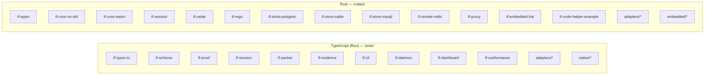
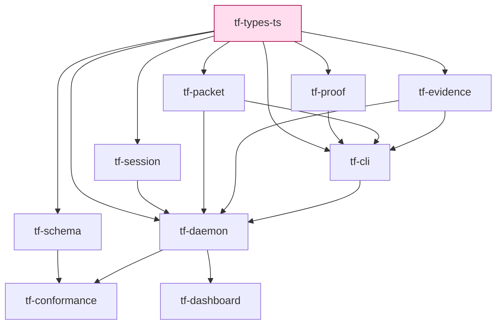

# Dependency graph

This page is a hand-curated dependency graph of every TrustForge
crate (Rust) and tool (TypeScript / Bun). It is regenerated by
hand when crate boundaries move; if you have `cargo depgraph`
installed locally, `cargo depgraph --workspace-only` produces the
machine-readable form for the Rust side.

## Workspace overview



## Rust dependency graph

```mermaid
flowchart TB
    TFT[tf-types]:::core
    TFNS[tf-core-no-std]:::core
    TFW[tf-core-wasm]:::core

    TSE[tf-session]
    TCD[tf-cedar]
    TRG[tf-rego]
    TSP[tf-store-postgres]
    TSL[tf-store-sqlite]
    TSM[tf-store-mysql]
    TRR[tf-revoke-redis]
    TPX[tf-proxy]
    THE[tf-embedded-hal]
    TCH[tf-code-helper-example]
    EM_LORA[embedded/tf-stm32wl-lora]
    EM_ESP[embedded/tf-esp32-wifi]
    EM_NRF[embedded/tf-nrf52-ble]
    EM_RP[embedded/tf-rp2040-picow]
    EM_AVR[embedded/tf-avr-atmega328]
    EM_C3[embedded/tf-esp32c3-uart]
    EM_BL[embedded/tf-bootloader-example]

    TFT --> TSE
    TFT --> TCD
    TFT --> TRG
    TFT --> TSP
    TFT --> TSL
    TFT --> TSM
    TFT --> TRR
    TFT --> TPX
    TFT --> TCH
    TFNS --> THE
    TFNS --> EM_LORA
    TFNS --> EM_ESP
    TFNS --> EM_NRF
    TFNS --> EM_RP
    TFNS --> EM_AVR
    TFNS --> EM_C3
    TFNS --> EM_BL
    THE --> EM_LORA
    THE --> EM_ESP
    THE --> EM_NRF
    THE --> EM_RP
    THE --> EM_AVR
    THE --> EM_C3
    TSE --> TPX

    classDef core fill:#fde,stroke:#a04
```



### What each Rust crate is for

| Crate | Layer(s) | What lives here |
|---|---|---|
| `tf-types` | 1, 5, 6, 7, 9 | Schema-bound types, canonical-JSON, ed25519, X25519, HKDF, ChaCha20-Poly1305, BLAKE3/SHA-256, capability evaluation, packet model, ProofRPC frames, anchors. The "everything" crate. Std-only. |
| `tf-core-no-std` | 1, 5 | The subset of `tf-types` that compiles `no_std` and runs on Cortex-M / RISC-V / AVR. Used by every embedded crate. |
| `tf-core-wasm` | 1, 5, 6 | Browser/edge build using `wasmtime` runtime types where applicable. |
| `tf-session` | 4 | TCP / duplex carrier driver for the live-mode handshake. Length-delimited framing for TF-0013. |
| `tf-cedar` | 7 | Cedar policy engine adapter producing TrustForge `Decision` values. |
| `tf-rego` | 7 | Rego (OPA) policy adapter; same output shape as `tf-cedar`. |
| `tf-store-postgres` / `tf-store-sqlite` / `tf-store-mysql` | 9 | Backend implementations for the proof event store. |
| `tf-revoke-redis` | 9 | Redis-backed revocation index for high-cardinality fleets. |
| `tf-proxy` | 4, 6, 9 | HTTP front-end / reverse proxy that gates upstream requests on TrustForge decisions. |
| `tf-embedded-hal` | 4, 5 | embedded-hal abstractions used by the per-MCU embedded crates. |
| `tf-code-helper-example` | 6, 7 | Downstream crate that consumes generated ProofRPC code; used as a parity test fixture. |
| `embedded/tf-stm32wl-lora` | 5 | LoRa carrier example (constrained profile). |
| `embedded/tf-esp32-wifi` | 4, 5 | ESP32 WiFi carrier example. |
| `embedded/tf-nrf52-ble` | 5 | Nordic nRF52 BLE peripheral example. |
| `embedded/tf-rp2040-picow` | 4, 5 | Pi Pico W example. |
| `embedded/tf-avr-atmega328` | 5 | ATmega328 sign-only example (very constrained). |
| `embedded/tf-esp32c3-uart` | 5 | ESP32-C3 UART carrier example. |
| `embedded/tf-bootloader-example` | 9 | Signed-boot example using TrustForge proof events. |

## TypeScript dependency graph



### What each tool is for

| Tool | Role |
|---|---|
| `tools/tf-types-ts` | Generated TS bindings + hand-written core (canonical JSON, signing, framing). Mirror of `crates/tf-types`. |
| `tools/tf-schema` | `validate`, `lint`, `bundle`, `codegen`, `fuzz`, `parity`, `agent-contract-check`. The build / quality gate. |
| `tools/tf-proof` | `keygen`, `sign`, `verify`, `inspect`, `derive-pubkey` for proof events. |
| `tools/tf-session` | WebSocket carrier (TS-side) for the live-mode handshake. |
| `tools/tf-packet` | `sign`, `verify`, `inspect`, `fragment`, `reassemble`, `simulate-lora`. |
| `tools/tf-evidence` | `assemble`, `verify`, `seal`, `open`, `anchor`, `replay`, `redact`. |
| `tools/tf-cli` | The unified `tf` command. Routes to all of the above plus daemon admin. |
| `tools/tf-daemon` | The enforcement plane: vault, sessions, ProofRPC, admin HTTP, plugin host, AgentGuard, ApprovalQueue, federation, anchors. |
| `tools/tf-dashboard` | Read-only web dashboard reading the daemon admin endpoint. |
| `tools/tf-conformance` | Runs every conformance category (schema, signature, guard, trust-overlay, bridge, interop, fuzz, profile, security, AI-implementation, label) in one shot. |
| `tools/adapters/*` | Per-framework adapters (Express, Remix, MCP, A2A) that call the daemon's admin API. |
| `tools/native/*` | Native-language plugins shipped as Worker-isolated TS modules. |

## Cross-language pairing

For every wire-format object there are exactly two sources of truth:

- The TS implementation under `tools/tf-types-ts/`.
- The Rust implementation under `crates/tf-types/`.

Both consume the schemas under [`../../schemas/`](../../schemas/) and
both are gated by `conformance/parity.yaml`. Adding a new field
requires:

1. Update the schema and fixtures.
2. Regenerate TS and Rust bindings.
3. Update `conformance/parity.yaml` with new vectors.
4. Run `bun test` and `cargo test --workspace`.

## Forbidden dependency edges

The graph above does not show edges that **must not exist**. They are
called out here so a contributor reviewing a PR can spot a violation:

- Nothing in `crates/tf-core-no-std` may depend on `std`. Check by
  building the crate without `std` and against an embedded target
  (e.g. `cargo check --target thumbv7em-none-eabihf -p tf-core-no-std`).
- Nothing in `tools/tf-types-ts` may depend on Bun-specific APIs in
  the generated section; only the hand-written core may.
- Nothing in `crates/tf-types` may depend on a daemon-side concern
  (storage, admin HTTP, dashboard).
- Nothing in `crates/tf-store-*` may import another store crate;
  they are alternative backends, not layered.
- Embedded crates must not pull `tf-types`; they pull
  `tf-core-no-std` only.

## Regenerating

```bash
# Rust side (requires: cargo install cargo-depgraph)
cargo depgraph --workspace-only > /tmp/depgraph.dot
dot -Tsvg /tmp/depgraph.dot -o /tmp/depgraph.svg

# TS side: tsc --listFiles or madge over tools/
bunx madge --image /tmp/ts-depgraph.svg tools/
```

Use the output to spot-check this page before a release; do not
auto-commit machine output, prefer adjusting the curated diagrams
above.
