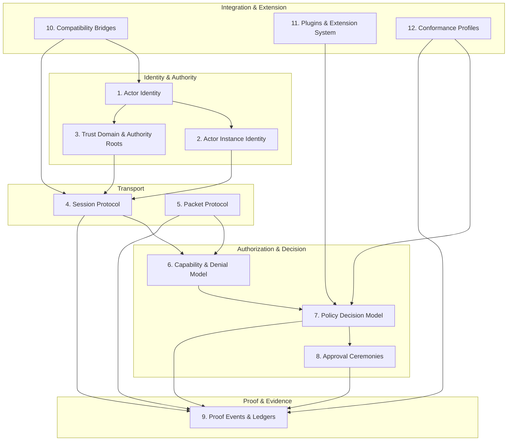
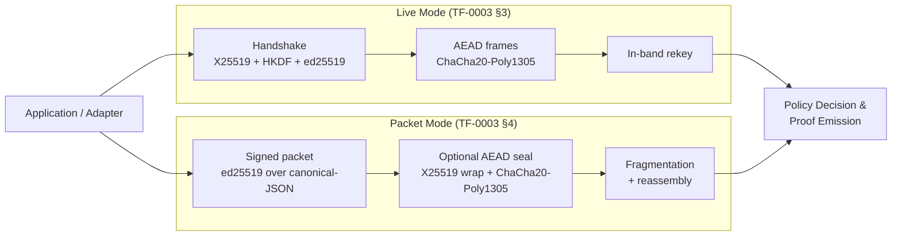
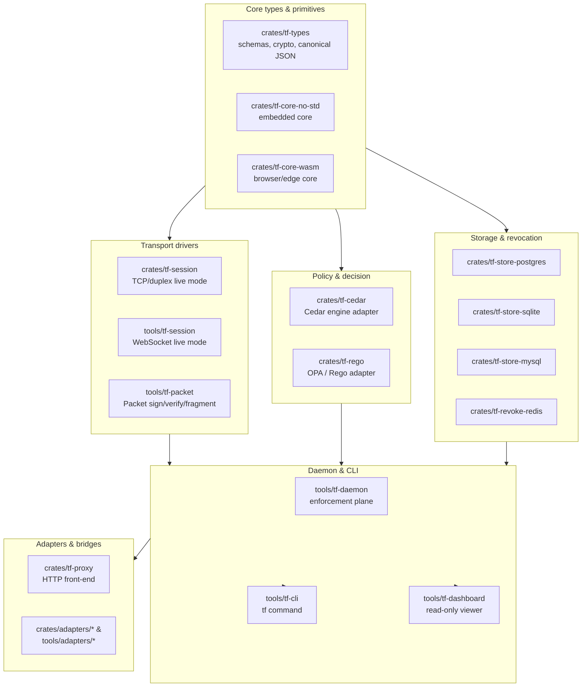

# System overview

This page is the single picture of TrustForge: the 12 layers from
[`../specs/TF-0001-core-architecture.md`](../specs/TF-0001-core-architecture.md),
the two operating modes (Live and Packet), and the placement of the
reference implementation crates and tools in
[`../../crates/`](../../crates/) and [`../../tools/`](../../tools/).

## The 12 layers

Layers do not gate each other rigidly: a packet (layer 5) carries an
actor identity (layer 1), is authorized by capabilities (layer 6),
runs through policy (layer 7), and emits a proof event (layer 9), all
without ever needing a live session (layer 4). Live mode is the same
data plane plus an authenticated channel.

## Live Mode vs. Packet Mode

The two modes are first-class. Either mode can carry any layer-6/7/8
operation and any layer-9 proof emission. Designs that assume only
live mode (always-online, request/response) miss the packet/offline
deployments; designs that assume only packet mode miss the
continuous-authorization story.

## Where the implementation lives

The reference implementation is intentionally split: types and core
algorithms in `tf-types`, transport drivers per carrier, daemons and
CLIs as orchestrators.

## Profile gating

Profiles ([`../profiles/`](../profiles/)) sit on top of the layer
stack. They do not change the architecture; they pick which features
of each layer are required, recommended, or forbidden for a given
deployment class. The same daemon binary serves home, enterprise,
constrained, and compliance-evidence by reading
`.tf/profile.yaml` and asserting MUST features at boot. See
[`../profiles/home-profile.md`](../profiles/home-profile.md),
[`../profiles/enterprise-profile.md`](../profiles/enterprise-profile.md),
[`../profiles/constrained-profile.md`](../profiles/constrained-profile.md),
and
[`../profiles/compliance-evidence-profile.md`](../profiles/compliance-evidence-profile.md).

## Cross-cutting invariants

These invariants hold at every layer:

- **No custom crypto.** Every primitive listed in
  [`../security/cryptography.md`](../security/cryptography.md) is a
  reviewed standard. New primitives require an ADR.
- **Crypto-agile by construction.** Every signed object carries an
  algorithm identifier; the post-quantum hybrid mode (FIPS-204
  ml-dsa-44/65/87) is part of layer 1 and 4 from day one.
- **Negative capabilities override positive grants.** This is layer 6
  policy and is required by every consumer of layer 7 decisions.
- **Live and Packet share an object model.** Anything that can be done
  in live mode can be done as a sequence of packets. The reverse is
  also true.
- **Proof events are first-class.** Layer 9 emits structured,
  hash-chained, optionally-anchored events; these are the audit and
  evidence substrate.

## How layers map to documents

| Layer | Spec | Concept doc |
|---|---|---|
| 1 Actor Identity | [TF-0002](../specs/TF-0002-actor-identity.md) | [actors-vs-instances.md](../concepts/actors-vs-instances.md) |
| 2 Actor Instance Identity | [TF-0002](../specs/TF-0002-actor-identity.md) | [actors-vs-instances.md](../concepts/actors-vs-instances.md) |
| 3 Trust Domain & Authority Roots | [TF-0002](../specs/TF-0002-actor-identity.md) | [trust-domains.md](../concepts/trust-domains.md) |
| 4 Session Protocol | [TF-0003](../specs/TF-0003-proofwire-transport.md) | [sessions-vs-packets.md](../concepts/sessions-vs-packets.md) |
| 5 Packet Protocol | [TF-0003](../specs/TF-0003-proofwire-transport.md) | [sessions-vs-packets.md](../concepts/sessions-vs-packets.md) |
| 6 Capability & Denial | [TF-0004](../specs/TF-0004-capabilities-policy.md) | [capabilities-and-negative-capabilities.md](../concepts/capabilities-and-negative-capabilities.md) |
| 7 Policy Decision | [TF-0004](../specs/TF-0004-capabilities-policy.md) | [policy-decisions.md](../concepts/policy-decisions.md) |
| 8 Approval Ceremonies | [TF-0004](../specs/TF-0004-capabilities-policy.md) | [approval-ceremonies.md](../concepts/approval-ceremonies.md) |
| 9 Proof Events & Ledgers | [TF-0005](../specs/TF-0005-proof-events-ledgers.md) | [proof-events-and-ledgers.md](../concepts/proof-events-and-ledgers.md) |
| 10 Compatibility Bridges | [TF-0009](../specs/TF-0009-compatibility-bridges.md) | [`../bridges/`](../bridges/) |
| 11 Plugins & Extensions | [TF-0008](../specs/TF-0008-plugins-extensions.md) | — |
| 12 Conformance Profiles | [TF-0010](../specs/TF-0010-conformance-governance.md) | [profiles-and-enforcement-levels.md](../concepts/profiles-and-enforcement-levels.md) |

The site-to-site binary path
([TF-0013](../specs/TF-0013-site-to-site-binary-path.md)) extends
layer 4 with a length-delimited TCP framing layer and a new ProofRPC
method kind, `http-bridge`. See
[`../topologies/site-to-site.md`](../topologies/site-to-site.md) for
the deployment shape.
