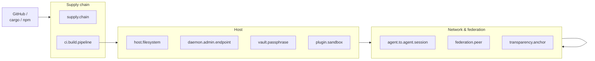

# Threat boundaries

This page is the readable rendering of
[`../../.tf/threat-model.yaml`](../../.tf/threat-model.yaml). The YAML
is the source of truth — schema-validated, machine-readable, and
referenced by `.tf/agent-contract.yaml`. This page exists so that
contributors and security reviewers can read the model in prose and
see the boundaries on a diagram.

A complementary security-narrative version is in
[`../security/threat-model.md`](../security/threat-model.md); this
page focuses on the boundaries (where a threat crosses) while the
security narrative focuses on the threats themselves.

## The nine trust boundaries

Each boundary corresponds to one `assets[]` entry in
`.tf/threat-model.yaml`. Crossing the boundary requires authority,
proof, or both.

The risk class column is the `criticality` field in the YAML, on the
TF-0004 R0–R5 scale (see
[`../concepts/risk-classes-r0-to-r5.md`](../concepts/risk-classes-r0-to-r5.md)).

| Boundary asset id | Risk class | One-line meaning |
|---|---|---|
| `ci.build.pipeline` | R4 | CI runners, signing keys, artefact pipeline — owns the project's release identity. |
| `supply.chain` | R4 | Pinned upstream packages, lockfiles, registry mirrors. |
| `host.filesystem` | R3 | Local files visible to the daemon and to agents under `.tf/agent-contract.yaml`. |
| `daemon.admin.endpoint` | R5 | Vault unlock, policy reload, key rotation. Highest blast radius. |
| `plugin.sandbox` | R3 | OS sandbox separating plugins from host daemon state. |
| `vault.passphrase` | R5 | Argon2id-stretched secret unlocking long-term private keys. |
| `federation.peer` | R4 | A separate trust domain that we have explicitly federated with. |
| `transparency.anchor` | R4 | The append-only log relied on for inclusion + revocation timeliness. |
| `agent.to.agent.session` | R4 | Live and packet sessions across actor instances — capability inflation here breaks everything. |

## The 24 threats

The threats below are the `attack_classes[]` in the YAML. They are
grouped by the boundary they cross; one threat may apply at more
than one boundary.

### Supply-chain crossing

- `supply-chain-compromise` — a poisoned upstream pushes a malicious
  release into our build.
- `dependency-typosquat` — a typosquat lookalike package gets
  installed in CI or contributor machines.

Mitigations: `dependency-pinning-and-review`,
`schema-strict-additional-properties`.

### Vault crossing

- `vault-passphrase-brute-force` — captured vault file decrypted
  offline.
- `vault-tamper` — partial-write or in-place modification of a
  serialized vault.

Mitigations: `argon2id-vault-kdf`, `vault-atomic-persist`.

### Daemon admin endpoint

- `daemon-admin-token-theft` — bearer admin token reused from another
  process or after rotation.
- `regex-dos-in-policy-engine` — pathological policy regex stalls
  the daemon.

Mitigations: `daemon-admin-token-binding` (planned),
`regex-dos-prevention`.

### Plugin sandbox

- `plugin-sandbox-escape` — plugin code reaches host capabilities not
  declared in its manifest.

Mitigation: `plugin-sandbox-capability-gate` (planned).

### Agent-to-agent session

- `ed25519-forgery-via-key-reuse` — same key signs different object
  classes without domain separation.
- `replay-attack` — captured frame or packet replayed to a second
  audience or session.
- `aead-nonce-reuse` — XChaCha20-Poly1305 key+nonce reuse leaks
  plaintext.
- `time-skew-clock-attack` — clock manipulation widens token validity
  windows.
- `capability-inflation` — issued capability gets widened by a
  glob/path/regex trick.
- `negative-capability-bypass-via-glob` — caller-controlled input
  smuggles past `deny_targets`.
- `webauthn-assertion-replay` — assertion captured at one origin
  replayed at another.
- `relay-forwarding-authority-confusion` — relay's forwarding token
  used as if it carried action authority.

Mitigations: `ed25519-domain-separation`, `aead-nonce-discipline`
(planned), `clock-skew-tolerance`, `capability-token-aud-bind`,
`negative-capability-precedence`, `glob-escape-on-action-targets`,
`webauthn-challenge-binding` (planned),
`relay-forwarding-authority-split`.

### Federation peer

- `federated-peer-compromise` — a peer's long-term keys leak.
- `oauth-issuer-spoof` — an attacker impersonates an OAuth issuer
  trusted in the OAuth bridge.
- `spiffe-federation-poisoning` — bad SPIFFE bundle accepted as
  authoritative.
- `certificate-chain-bypass` — TLS chain validation skipped or
  weakened.
- `ocsp-stapling-tamper` — OCSP staple replaced with stale or
  attacker-controlled value.
- `mcp-tool-list-spoof` — extra fields injected in an MCP tool list.
- `a2a-agentcard-impersonation` — fake A2A AgentCard accepted.

Mitigations: `federation-issuer-key-verify`,
`schema-strict-additional-properties`, `tls-and-ocsp-pinning`
(planned).

### Transparency anchor

- `transparency-anchor-takeover` — a single anchor compromised and
  used to rewrite history.

Mitigation: `transparency-anchor-pinning` (planned).

### AI-agent specific

- `ai-agent-prompt-injection` — prompt context manipulated to make
  the agent escalate beyond its declared `.tf/agent-contract.yaml`.

Mitigation: `negative-capability-precedence` plus the AI-agent
contract review process documented in
[`../ai-implementation.md`](../ai-implementation.md).

## Boundary-to-flow map

| Flow (see [`data-flows.md`](data-flows.md)) | Crosses |
|---|---|
| A. Live handshake | `agent.to.agent.session` |
| B. Packet sign+verify | `agent.to.agent.session`, optionally `host.filesystem` |
| C. `/v1/decide` | `daemon.admin.endpoint`, `host.filesystem` |
| D. `/v1/import-credential` | `daemon.admin.endpoint`, `federation.peer` |
| E. `/v1/proof/sign|verify` | `daemon.admin.endpoint`, `transparency.anchor` |
| F. Federation join | `federation.peer`, `transparency.anchor` |
| G. Evidence assemble | `transparency.anchor`, `host.filesystem` |
| H. Site-to-site `http-bridge` | `agent.to.agent.session`, `federation.peer` |

## Residual risks

The YAML lists six residual risks the v0.1.0 design explicitly does
**not** defend against. They are accepted by the maintainers, signed
by `tf:actor:human:trustforge.dev/maintainers`, and dated:

1. Compromised host kernel (memory access, ptrace, `.tf/` tamper).
2. Compromised TPM / HSM (hardware lies).
3. Physical key extraction from cold storage.
4. Side-channel leakage in upstream crypto libraries.
5. Malicious browser scraping the user session.
6. Malicious LSP / IDE auto-completing TrustForge actions.

If a deployment must close one of these gaps, that is a profile
decision (see [`../profiles/`](../profiles/)) and an ADR. Do not file
any of these as architectural defects against 0.1.0 — they are
acknowledged out of scope.

## Reading the YAML directly

The YAML is intentionally close to this prose. Each `mitigations[]`
entry has:

- `applies_to`: the assets and attack classes it defends.
- `description`: one paragraph of human prose.
- `status`: `implemented` or `planned`.

The reference implementation only counts `implemented` items toward
profile MUSTs; `planned` items are advisory until they ship.
