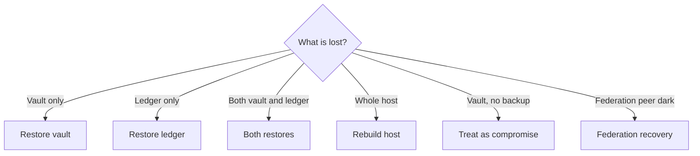

# Disaster recovery

How to back up a TrustForge deployment, how to restore it after a
catastrophic loss, and how to recover federation when one or more
peers go dark for an extended period.

This page is the planning document. The execution-time runbook
for incidents in progress lives in
[`runbook-incident.md`](runbook-incident.md).

## What "disaster" means here

For TrustForge, a disaster is loss of one or more of:

1. The **vault** (long-term keys).
2. The **proof ledger** (audit trail).
3. The **federation state** (peer key pins).
4. The **policy bundle** and **profile**.
5. The **host** itself.

The recovery path differs for each. The worst case is loss of the
vault without backup — that is operationally equivalent to a
total trust-domain compromise; see `R4` in the incident runbook.

## What to back up

| Artefact | Frequency | Where |
|---|---|---|
| `vault.tfvault` | After every key operation; daily otherwise | Encrypted backup destination, off-host, geographically separated. |
| Proof ledger | Hourly (Postgres WAL); weekly full dumps | Object storage with versioning. |
| `.tf/*.yaml` (config) | After every change | Git, encrypted secrets in a secret manager. |
| Federation peer bundles | After every federation acknowledge | Same place as configs. |
| Anchor inclusion proofs | As emitted | Same place as ledger. |
| Vault passphrase | On creation and on every rotation | Out-of-band store: HSM, sealed envelope, password manager with break-glass. |
| Embedded firmware images | Per release | Image registry with content-addressed storage. |

## Backup mechanics

### Vault backup

The vault is a single file. Backing it up is `cp`. The file is
already encrypted (Argon2id-stretched passphrase + ChaCha20-Poly1305
seal) so the **backup destination itself does not need to be
trusted with the cleartext key**. It does need to be trusted not
to delete the backup.

```bash
# Daily backup, retained for 30 days.
cp /var/lib/trustforge/vault.tfvault \
   /backups/vault-$(date +%F).tfvault
find /backups -name 'vault-*.tfvault' -mtime +30 -delete
```

The vault is small (a few KiB). Keep many copies.

### Ledger backup

For SQLite:

```bash
# Atomic snapshot (sqlite3 .backup).
sqlite3 /var/lib/trustforge/ledger.db ".backup /backups/ledger-$(date +%F).db"
```

For Postgres / MySQL: standard WAL archiving + periodic full
dumps. The ledger is append-only, so incremental backups are
small; use that to keep RPO under an hour.

### Configuration backup

`.tf/*.yaml` files are plain text and belong in version control
with the rest of your operational configuration. The vault
passphrase and admin token are **secrets** and belong in a
secret manager (not git).

### Federation peer bundles

When you `tf trust-domain federate --bundle <…>`, save the
bundle file alongside your configs. If you lose it, you can
re-fetch from the peer (out of band).

## Recovery scenarios



### Vault restore

1. Stop the daemon.
2. Replace `vault.tfvault` with the backup copy.
3. Start the daemon. Verify with `tf actor inspect <known-uri>`.

The daemon notices the restore via the integrity tag — if the
backup is from a different chain than the current ledger, the
daemon will refuse to boot until you also restore the ledger or
explicitly accept the divergence.

### Ledger restore

1. Stop the daemon.
2. Replace the ledger backend (drop and reload Postgres, or copy
   the SQLite file from backup).
3. Start the daemon. The next `pe.*` event written extends the
   restored chain.

If the ledger is restored to a point earlier than the latest
chain hash federated peers know about, peers will treat
subsequent events as a fork and refuse them. To resolve:

1. Use `tf evidence assemble --kind ledger-fork-resolution` to
   produce a signed fork-resolution event.
2. Federate the resolution to peers.
3. Resume operations.

This is a deliberate hard-stop — silent rewrites of an
append-only log break the entire trust model.

### Both vault and ledger

This is the easy case if you have both backups: restore both,
boot, verify chain hashes match, resume.

### Whole-host rebuild

1. Provision a new host with the same OS and TrustForge version.
2. Restore all backups (vault, ledger, config).
3. Restore secrets from the secret manager.
4. Start the daemon.
5. Run health checks.
6. (If the host was federated) refresh peer pins; some peers may
   require an explicit acknowledgement of the restored
   instance key.

### Vault lost without backup

Treat as **R4 — Key compromise** (incident runbook). The trust
domain root is gone; the practical recovery is to mint a brand-new
trust domain and re-federate every peer.

This is the worst-case scenario. It is what the off-host vault
backup exists to prevent. Test the backup restore quarterly so
you find out it doesn't work *before* you need it.

## Federation recovery

A peer goes dark for an extended period (compromised, hardware
failure, organisation pivot). Two outcomes:

### Peer comes back

When a peer returns, two things may have happened:

- They rotated their root key while away. They will issue a
  rotation announcement; you must acknowledge it explicitly per
  [`runbook-incident.md`](runbook-incident.md) §R2.
- They emit historical events you missed. The proof events are
  replayable: pull a `.tfbundle` of the missed window and feed it
  through `tf evidence verify`.

### Peer never comes back

Issue a `pe.federation.peer.deprecated` event signed by your own
domain root, marking the peer's keys as no-longer-recognised
locally. Capabilities issued by the deprecated peer fail closed
from then on.

If the peer's keys are believed compromised, also mint
`pe.federation.peer.revoked` and broadcast it to remaining peers
through every available carrier (live, packet, federation,
anchor).

## Restore drills

A backup is only as good as the last successful restore. Run
quarterly drills:

1. Spin up a new host (or container).
2. Restore the most recent backup.
3. Boot the daemon.
4. Run `tf-conformance run` against the restored deployment.
5. Hit the health endpoints (`/v1/health`, `/v1/health/ready`).
6. Document the time taken; that is your RTO.

Document the RPO from "last write before disaster" to "newest
event in the backup". For most operators, the targets are:

- RTO: under 30 minutes.
- RPO: under 1 hour.

If your environment cannot meet those, document the relaxed
targets in `daemon.yaml` (as a comment) so the on-call team
knows.

## Anchor recovery

If you used RFC 6962 / RFC 3161 anchoring and the anchor service
disappears:

- Existing anchored proofs remain verifiable as long as you can
  still fetch the anchor's signed root.
- New events emitted in the anchor outage cannot reach L4/L5;
  they sit at L3 until a substitute anchor is wired up.
- Switch anchors via `daemon.yaml` and reload. Existing events
  keep their original anchor; new events use the new one.

## Embedded fleet recovery

Embedded crates do not run a vault in the desktop sense. They
hold their key in flash or a secure element. Recovery scenarios:

- **Device lost**: revoke the actor key associated with the
  device (`tf actor revoke`). Mint a replacement onto a
  replacement device.
- **Firmware bricked**: re-flash the bootloader (see
  `crates/embedded/tf-bootloader-example/`); the device's
  long-term key persists in the secure region and re-binds on
  next boot.
- **Whole fleet image lost**: rebuild from source. Per-device
  keys are not re-issuable from a centralised backup by design;
  each device mints its own key on first boot.

## What to keep printed

In a binder, on paper, near the on-call desk:

1. This page.
2. The incident runbook ([`runbook-incident.md`](runbook-incident.md)).
3. The fingerprints of the federation peers (so you can verify
   them out-of-band).
4. A break-glass contact list: who has the vault passphrase,
   how to reach them, and how to verify their identity.
5. The location and credentials of the off-host backup.

If the site is on fire, you will not be able to read the
runbook from the same machine.

## Lessons applied to TrustForge itself

The repo's own `.tf/threat-model.yaml` enumerates "compromised
host kernel", "compromised TPM/HSM", and "physical key
extraction" as residual risks. None of those is *recoverable*
through the procedures here — they are accepted gaps.
Disaster-recovery covers operational losses (disk, host, region,
peer); compromise of the underlying platform is a different
escalation.
