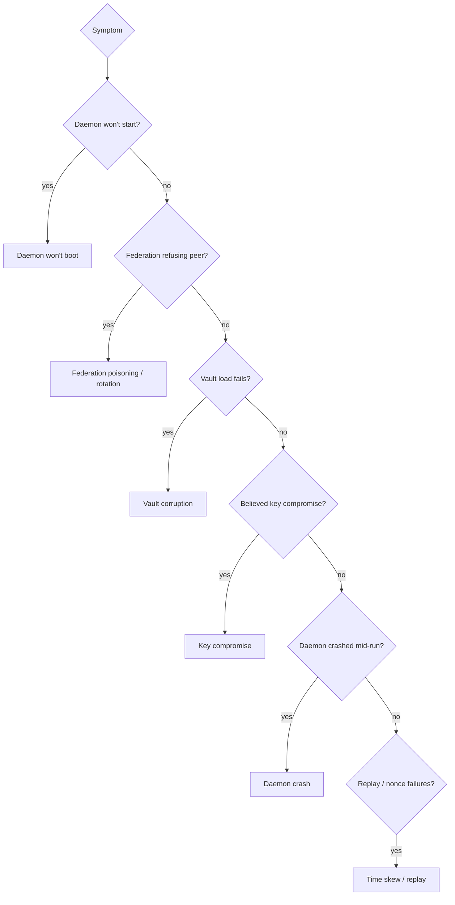
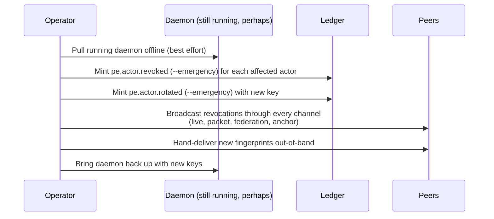

# Incident runbook

Step-by-step responses for the most common incidents in a
TrustForge deployment. Print this. Test it. Print it again.

This runbook assumes you have read
[`installation.md`](installation.md) and
[`configuration.md`](configuration.md), and you know where the
daemon's vault, ledger, and configuration live on your hosts.

Do **not** improvise on key compromise. Follow the steps in order.

## Quick triage tree



## R1 — Daemon won't boot

**Symptom**: `tf-daemon run` exits non-zero before serving requests.

1. Capture the full log. Look for the *last* line before exit;
   it usually names the failed assertion.
2. Common causes and fixes:
   - **`profile MUST not satisfied: rfc6962-anchor`** — the
     asserted profile requires an anchor; either configure one in
     `daemon.yaml` or assert a less-strict profile (only acceptable
     in non-prod).
   - **`Address already in use`** — another process holds a
     listener port. Find with `lsof -i :8787` (or the relevant
     port) and resolve.
   - **`vault load failed: integrity tag mismatch`** — vault
     tampered or corrupted. Go to **R3**.
   - **`vault load failed: passphrase incorrect`** — `TF_VAULT_PASS`
     is wrong; check the secret store. Don't re-mint the vault
     unless you have lost the passphrase.
3. If the daemon won't boot but the cause is unclear, run with
   `--dry-run` and `--print-config` to validate config alone.
4. If config validates and the daemon still won't boot, file a
   bug with the redacted config and the log.

## R2 — Federation poisoning or rotation

**Symptom**: Federated peer's actions are being denied; the daemon
logs `federation peer <domain> issuer key not pinned` or
`federation peer <domain> announced rotation; awaiting acknowledge`.

This is by design. The daemon refuses to silently accept a
rotated or unknown federation key.

1. Confirm the rotation is legitimate. **Out of band.**
   Phone, signed email, or known-good chat. Do not rely on the
   peer's own reachable channels.
2. If legitimate, pull the new bundle from the peer:
   ```bash
   curl -O https://b.example/.well-known/trustforge/bundle
   ```
3. Verify the bundle's signature against an out-of-band-confirmed
   fingerprint:
   ```bash
   tf trust-domain verify-federation --bundle bundle.json \
       --expected-fingerprint <…>
   ```
4. Acknowledge the rotation:
   ```bash
   tf trust-domain federate --acknowledge-rotation \
       --bundle bundle.json
   ```
5. The daemon emits `pe.federation.peer.rotation_acknowledged` and
   resumes trusting the peer.

If the rotation is **not** legitimate, treat as compromise of the
peer (escalate per your incident plan; do not acknowledge; emit a
`pe.federation.peer.suspect` event for your audit trail).

## R3 — Vault corruption

**Symptom**: `vault load failed: integrity tag mismatch` or
`vault load failed: header parse error`.

1. **Stop**. Do not write to the vault file.
2. Check disk health (`smartctl`, cloud-provider equivalent).
3. Check whether you have an off-host backup of the vault file
   from before corruption.
4. If you have a backup:
   ```bash
   systemctl stop trustforge
   cp /backups/vault-<timestamp>.tfvault /var/lib/trustforge/vault.tfvault
   systemctl start trustforge
   ```
   Compare emitted proof events between backup-time and now;
   any actions taken in that gap will need replay or
   reconciliation.
5. If you do **not** have a backup, the long-term private keys are
   gone. Treat this as **R4 — Key compromise**.

## R4 — Key compromise

**Symptom**: Long-term key material is suspected leaked, or the
vault was lost. Treat as severity R5 by default.



Detailed steps:

1. **Contain**. Stop the affected daemon (`systemctl stop
   trustforge`). If the host is suspected compromised, isolate
   the host as well.
2. **Rotate the vault passphrase** if you suspect the
   passphrase leaked. Use `tf actor rotate --emergency` to mint
   new keys; the old vault is now read-only history.
3. **Emit emergency revocations**:
   ```bash
   tf actor revoke --actor <uri> --reason key-compromise --emergency
   ```
   Repeat for every affected actor.
4. **Broadcast**. Run `tf evidence assemble --kind revocation` to
   produce a `.tfbundle` of the revocations and ship it to every
   federated peer through every available carrier. Sneakernet
   counts.
5. **Mint replacements**:
   ```bash
   tf actor rotate --actor <uri> --emergency
   ```
6. **Notify peers out-of-band** of the new fingerprints; they will
   refuse to acknowledge the rotation until you do.
7. **Audit** recent proof events for any actions taken under the
   compromised key window. Anything suspect: emit a
   `pe.action.invalidated` referencing the original event.
8. **Postmortem**. Document the root cause; if it should be added
   to `.tf/threat-model.yaml`, do so in the same PR that captures
   any mitigation work.

For the security disclosure path, see
[`../security/disclosure.md`](../security/disclosure.md).

## R5 — Daemon crash

**Symptom**: Daemon exits unexpectedly; supervisor restarts it.

1. Capture the crash log. If `--log-format json`, the structured
   fields point you to the offending request.
2. Check for OOM (`dmesg | grep -i killed`); raise the cgroup
   limit or move to a larger host.
3. Check for ledger errors. If Postgres is full or unreachable,
   the daemon refuses to commit proof events; it does not silently
   drop them.
4. If the crash recurs, capture a heap dump (Bun: `bun --inspect-brk`,
   Rust: `RUST_BACKTRACE=full`).
5. Open an issue with:
   - Version (`tf --version`).
   - Effective config (`--print-config`).
   - The last 200 lines of log.
   - A repro request if the crash is request-driven.

The supervisor (systemd / launchd / Kubernetes) should restart
the daemon with `Restart=on-failure` and a back-off. Do not run
the daemon without a supervisor in production.

## R6 — Time skew / replay failures

**Symptom**: `replay-attack: nonce already seen` or
`time-skew-clock-attack: ts outside tolerance`.

The daemon's clock-skew tolerance is 60s by default
(`clock-skew-tolerance` mitigation).

1. Check NTP / chrony. `chronyc tracking` or `timedatectl status`.
2. If multiple hosts: confirm they all sync to the same source.
3. If skew is small but persistent (5–30s), tighten NTP polling.
4. If skew is large (minutes), the system clock is wrong; do not
   widen tolerance — fix the clock.
5. If genuine replay is suspected (nonce reuse from a remote
   source), correlate to a specific actor:
   ```bash
   tf session inspect --filter actor=<uri>
   ```
   and treat it as a potential `agent.to.agent.session` boundary
   incident.

## Other useful commands during an incident

```bash
# Live tail of proof events.
tf admin events tail --filter kind=pe.action.denied

# Inspect a specific session.
tf session inspect --id <session-id>

# List pending approvals.
tf approval list

# Approve / deny under operator authority.
tf approve <approval-id>
tf deny <approval-id>

# Revoke a misbehaving actor (non-emergency).
tf revoke actor tf:actor:agent:example.com/bad

# Run conformance suite to confirm regression baseline.
tf-conformance run
```

## Communicating during an incident

- Use the channels named in your incident plan, not the
  potentially-compromised TrustForge transport.
- Keep a chronological log; the daemon's proof events are part of
  the evidence record.
- Tag the incident in your tracker with the affected boundary
  asset id from `.tf/threat-model.yaml`.

## After the incident

Within seven days:

1. Postmortem document.
2. Update `.tf/threat-model.yaml` if a new attack class was
   exercised.
3. Update this runbook if any step was wrong or missing.
4. Run a tabletop exercise on the next incident class.
