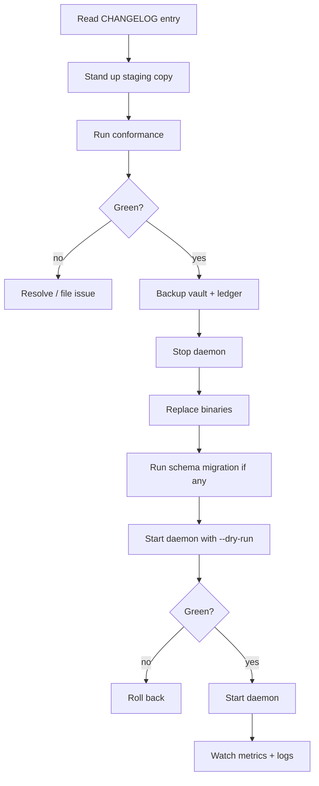

# Upgrade

How to move between TrustForge versions. The 0.x line is
explicitly experimental — breaking changes are allowed at minor
boundaries. Once 1.0 ships, semantic versioning kicks in.

## Versioning, today

- Pre-1.0: spec drafts may change; reference implementation moves
  with the spec. Every minor (0.1 → 0.2) is allowed to be
  breaking.
- Patch releases (0.1.0 → 0.1.1) are non-breaking.
- The wire format carries explicit algorithm and version fields
  so downgrade paths exist when needed.

## Cardinal rules

1. **Do not skip versions.** Always upgrade to the next minor.
   The breaking changes at each minor are tested against the
   one-back, not against arbitrary backwards compatibility.
2. **Conformance gate before deploy.** Run
   `bun run tools/tf-conformance/src/cli.ts run` against the new
   version on a staging copy of your config before touching prod.
3. **Vault first, daemon second.** Upgrades that touch the vault
   format require an explicit migration step; it is **never**
   safe to point a new daemon at a vault from a much older
   version without an explicit migration.
4. **Schema and code move together.** If the schemas change, the
   conformance fixtures change, and the daemon assertion changes.
   You will see schema-validation errors at boot if you try to
   run a new daemon against old `.tf/*.yaml` files without
   migrating them.

## Per-version notes

The per-minor breaking-change list lives at the top of
[`../../CHANGELOG.md`](../../CHANGELOG.md). Read the
"Known limitations" and any "Breaking changes" section in the
target version's entry before upgrading.

The 0.1.0 → 0.2.0 path (whenever 0.2 lands) is expected to:

- Move the constrained-mode runtimes
  (`OfflineRevocationListRuntime`, `PacketReceiver`,
  `signDeliveryReceipt`, `signProofOfForwarding`) from TS-only
  to also Rust.
- Move ProofRPC per-kind handler ergonomics from TS-only to also
  Rust.
- Bring CBOR byte-level parity flags on by default.
- Likely tighten admin-token binding to UDS peer-credential / loopback origin
  (`daemon-admin-token-binding` planned mitigation).
- Likely add ML-KEM hybrid KEX (PQ KEM) alongside X25519.

Each of these is a backwards-incompatible change for callers
relying on the old behaviour, so the upgrade requires an explicit
plan.

## Upgrade procedure



Step-by-step:

1. **Read the changelog**. Note any breaking changes; map them to
   your `daemon.yaml`, `policy.yaml`, and `agent-contract.yaml`.
2. **Staging copy**. Spin up a non-prod daemon with a copy of
   prod config (vault excluded — staging vault is its own).
3. **Conformance run**. From the new version's checkout:
   ```bash
   bun install
   cargo build --workspace
   bun run tools/tf-conformance/src/cli.ts run
   ```
4. **Backup**. On prod hosts:
   ```bash
   systemctl stop trustforge
   cp /var/lib/trustforge/vault.tfvault /backups/vault-$(date +%F).tfvault
   pg_dump tf_ledger > /backups/ledger-$(date +%F).sql
   tar czf /backups/etc-$(date +%F).tgz /etc/trustforge
   ```
5. **Replace binaries**. `git pull`, `bun install`, `cargo build
   --release`. Symlinks under `/opt/trustforge/bin/` are easiest
   to update.
6. **Migrate schemas** (if the changelog says so). Run:
   ```bash
   tf-daemon migrate --from <old-version> --to <new-version>
   ```
   The `migrate` command is non-destructive: it writes new files
   alongside old ones, asks you to confirm, then renames.
7. **Dry run**:
   ```bash
   tf-daemon run --config /etc/trustforge/daemon.yaml --dry-run
   ```
   Resolve any errors before starting the actual daemon.
8. **Start**. `systemctl start trustforge`. Watch the log for the
   "profile asserted" line.
9. **Watch metrics**. The dashboard (or your Grafana) should show
   active sessions returning, decisions resuming, no spike in
   `tf_replay_rejections_total`.

## Rollback

If the upgrade fails after the daemon has started:

1. `systemctl stop trustforge`.
2. Restore the vault and ledger from backup:
   ```bash
   cp /backups/vault-<date>.tfvault /var/lib/trustforge/vault.tfvault
   psql tf_ledger < /backups/ledger-<date>.sql
   ```
3. Revert the binaries (`git checkout <old-tag>`,
   `bun install`, `cargo build --release`).
4. Start the daemon at the old version.
5. File an upgrade-bug issue with logs, the version delta, and
   any errors.

Rollback is safe within the same minor; across minors, expect
the rollback to also require a vault and ledger restore (some
schema migrations are not invertible).

## Schema migration details

When a `schemas/*.schema.json` file changes incompatibly, the
fixtures under `schemas/fixtures/` change with it. The daemon
ships a migration tool that:

1. Reads each `.tf/*.yaml` file.
2. Validates against the *old* schema.
3. Applies a migration recipe (one-line transformations or
   structural rewrites).
4. Validates against the *new* schema.
5. Writes the new file alongside the old, with a `.bak` of the
   original.

The recipe lives at `tools/tf-cli/src/migrate/<from>-<to>.ts` (or
the Rust equivalent). Recipes are idempotent — running them twice
is safe.

## Federated upgrades

When upgrading a deployment with federated peers:

- The wire format is wire-compatible across patch versions
  unconditionally and across minor versions when the changelog
  says so explicitly.
- If the wire format changes, upgrade peers in a coordinated way:
  the new daemon supports both old and new wire formats during a
  deprecation window, but eventually the old format is dropped.
- Federation bundles may need to be re-issued; the changelog
  calls this out.

## Embedded fleets

Embedded crates (`crates/embedded/*`) follow the same versioning
but firmware updates are deployment-specific:

- Use a signed-boot bootloader (see
  `crates/embedded/tf-bootloader-example/`) so the upgrade itself
  is a TrustForge action.
- Stage the upgrade through the constrained profile's offline
  revocation list mechanism — old firmware is "revoked" the same
  way an actor key is.
- Keep at least one node on the previous version while the rest
  upgrade, so a regression is recoverable.

## Cargo workspace versioning

The Rust workspace ships every crate at the same version. When
0.2 lands, every `Cargo.toml` in `crates/` bumps simultaneously.
Downstream consumers should pin to a workspace-level version, not
to individual crate versions.

## Bun / TypeScript versioning

The TypeScript packages under `tools/` track the same version as
the Rust workspace. The conformance suite asserts cross-language
parity for every released version; do not run a 0.2.0 TS daemon
against a 0.1.0 Rust crate or vice-versa.

## Communication

Subscribe to:

- The `CHANGELOG.md` file in the repo (or GitHub releases).
- GitHub Security Advisories for security-driven patches.
- The `release-notes` channel of the project's discussion
  platform if/when one exists.

Operators are encouraged to keep at most two releases behind
HEAD; older than that and the upgrade path becomes a multi-step
exercise.
