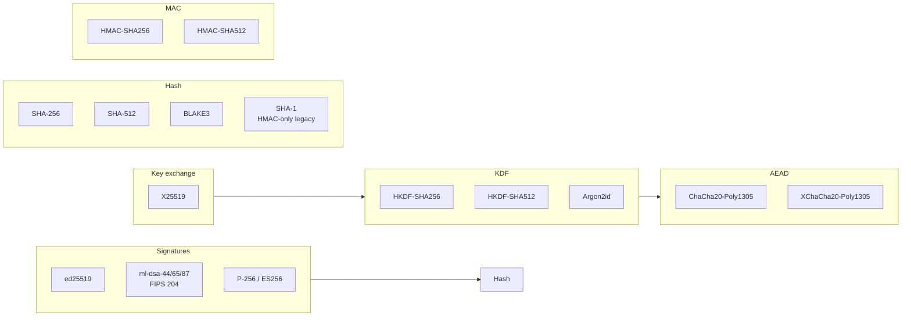

# Cryptography

Every cryptographic primitive used by TrustForge, by name, with the
source crate, version pin, why it was chosen, and its post-quantum
status. The version pins are the ones declared in
[`../../crates/tf-types/Cargo.toml`](../../crates/tf-types/Cargo.toml)
at the time of writing; if the file disagrees, the file wins.

The hard rule from `CLAUDE.md` and `SECURITY.md`: **no custom
cryptography**. Every primitive below is a reviewed, standardised
construction. Adding a new primitive requires an ADR.

## Quick map

## Signatures

### ed25519 (RFC 8032)

- **Crate (Rust)**: `ed25519-dalek` 2.x with `rand_core`, `pkcs8`,
  `pem` features.
- **Library (TS)**: `@noble/ed25519` (audited reference).
- **Used for**: actor long-term keys, instance-binding signatures,
  proof events, capability tokens, packet signatures, federation
  attestations, plugin manifests.
- **Why**: deterministic signatures, no nonce-reuse class of bugs,
  small (32 B pk / 64 B sig), audited implementations available
  cross-platform, IETF standard.
- **Domain separation**: each object class uses a distinct
  domain-separation tag so a signature cannot be lifted from one
  class to another (`ed25519-domain-separation` mitigation).
- **PQ status**: classical-only. Hybrid mode pairs every ed25519
  signature with an ml-dsa-44 signature for downstream verifiers
  that require PQ resistance.

### ml-dsa-44 / ml-dsa-65 / ml-dsa-87 (FIPS 204)

- **Crate (Rust)**: `fips204` 0.4 (CRYSTALS-Dilithium / ML-DSA).
- **Library (TS)**: WASM build of the same.
- **Used for**: post-quantum half of hybrid signatures over the same
  canonical-JSON payload as the ed25519 signature. ml-dsa-44 is the
  default; ml-dsa-65 / ml-dsa-87 for higher security profiles.
- **Why**: NIST-standardised post-quantum signature; FIPS 204 is the
  finalized form. Used in hybrid mode so verifier-side rollout does
  not require coordinated cutover.
- **PQ status**: PQ-ready. This is the hedge.

### ECDSA P-256 (FIPS 186 / SEC1)

- **Crate (Rust)**: `p256` 0.13 with `ecdsa` and `pem` features.
- **Used for**: bridge interop only — accepting WebAuthn assertions
  with ES256, OAuth JWS with ES256, X.509 leaf signatures from
  upstreams that issue P-256 keys.
- **Why**: required by WebAuthn (FIDO2), JOSE, and many TLS PKI
  hierarchies. We accept it, we do not mint new P-256 long-term
  keys.
- **PQ status**: classical-only and bridge-only.

## Key exchange

### X25519 (RFC 7748)

- **Crate (Rust)**: `x25519-dalek` 2.x with `static_secrets` feature.
- **Library (TS)**: `@noble/curves` X25519.
- **Used for**: ephemeral DH in the live-mode handshake
  (TF-0003 §3); recipient wrapping keys for sealed packets
  (TF-0003 §4); recipient wrapping keys for sealed evidence bundles
  (TF-0012).
- **Why**: standard, fast, constant-time implementations exist,
  pairs naturally with ed25519 long-term keys.
- **PQ status**: classical-only. PQ KEM is on the v0.2 roadmap (likely
  ML-KEM / FIPS 203) and will be added in hybrid mode the same way
  ml-dsa is layered with ed25519.

## Key derivation and password stretching

### HKDF-SHA256 / HKDF-SHA512 (RFC 5869)

- **Crate (Rust)**: `hkdf` 0.12 over `sha2` 0.10.
- **Library (TS)**: `@noble/hashes` hkdf.
- **Used for**: deriving `session_secret`, `client_key`,
  `server_key`, `client_iv`, `server_iv`, and exporter keys
  (RFC 5705 / RFC 8446) from the X25519 shared secret.
- **Why**: the canonical KDF, IETF standard, well-supported.
- **PQ status**: collision-resistance only matters at the underlying
  hash level; SHA-256 / SHA-512 are sufficient.

### Argon2id (RFC 9106)

- **Crate (Rust)**: `argon2` 0.5.
- **Library (TS)**: `@noble/hashes` argon2.
- **Used for**: stretching the vault passphrase into the symmetric
  key that seals long-term private keys at rest.
- **Why**: memory-hard KDF, RFC-standard, the recommended choice
  for password-based key derivation. Parameters are embedded in
  the vault header per `schemas/vault-file.schema.json`.
- **PQ status**: passphrase brute-force resistance is independent of
  PQ.

## AEAD

### ChaCha20-Poly1305 (RFC 8439)

- **Crate (Rust)**: `chacha20poly1305` 0.10.
- **Library (TS)**: `@noble/ciphers` chacha20poly1305.
- **Used for**: live-mode AEAD frames (TF-0003 §3.6), sealed packets
  (TF-0003 §4), sealed evidence bundles (TF-0012), vault file
  encryption.
- **Why**: software-fast, constant-time on common architectures,
  standard, widely audited.
- **PQ status**: 256-bit key, 128-bit Poly1305 tag — symmetric
  primitives have a Grover speedup that does not change the
  practical security level meaningfully.

### XChaCha20-Poly1305 (draft-irtf-cfrg-xchacha)

- **Crate (Rust)**: `chacha20poly1305` 0.10 (`xchacha` feature).
- **Used for**: where a random 192-bit nonce is preferable to a
  64-bit counter (long-lived sessions, packet streams without
  per-direction counters).
- **Why**: extended nonce removes the practical risk of nonce
  collision under random-nonce policies.

## Hashes

### SHA-256 / SHA-512 (FIPS 180-4)

- **Crate (Rust)**: `sha2` 0.10.
- **Library (TS)**: `@noble/hashes` sha256/sha512.
- **Used for**: canonical-JSON event hashing, transcript hashing in
  the handshake, RFC 5869 HKDF, RFC 6962 Merkle trees, RFC 3161
  timestamps, X.509 chains.
- **Why**: FIPS standard, available in every TPM/HSM.

### BLAKE3 1.x

- **Crate (Rust)**: `blake3` 1.x.
- **Used for**: large-blob hashing where SHA-256 is too slow
  (evidence bundles, plugin manifests).
- **Why**: fast, parallel, modern construction. Used **alongside**
  SHA-256, never instead — the canonical event hash is SHA-256.

### SHA-1 (legacy, HMAC-only)

- **Crate (Rust)**: `sha1` 0.10.
- **Used for**: HMAC-SHA1 in the webhook bridge **only**, where the
  upstream signs webhooks with HMAC-SHA1 (e.g. GitHub webhooks).
  Never used as a collision-resistant hash.
- **Why**: external compatibility. We will reject any attempt to use
  SHA-1 as a hash function for our own constructions.
- **PQ status**: irrelevant (HMAC-SHA1 is not affected by collision
  attacks).

## MACs

### HMAC-SHA256 / HMAC-SHA512 (RFC 2104)

- **Crate (Rust)**: `hmac` 0.12.
- **Used for**: webhook bridge signatures (HMAC-SHA256), some
  bridge-side authentication (e.g. matrix bridge HMAC paths).
- **Why**: industry standard, simple, well-supported.

## JWT / JOSE

- **Crate (Rust)**: `jsonwebtoken` 9.x.
- **Used for**: OAuth bridge (RFC 6749/6750), GNAP bridge (RFC 9635),
  DPoP (RFC 9449). Bridge-only — TrustForge's own capability tokens
  are **not** JWT.

## CBOR

- **Crate (Rust)**: `ciborium` 0.2.
- **Library (TS)**: `cbor-x`.
- **Used for**: `.tfbundle` and `.tfpkt` binary container formats.
- **Why**: compact, deterministic, widely supported. We do not rely
  on byte-identical canonical CBOR across implementations; we rely
  on round-trip correctness and per-side determinism.

## X.509

- **Crate (Rust)**: `x509-parser` 0.16 with `verify` feature.
- **Used for**: TLS chain verification, SPIFFE SVIDs, OAuth issuer
  metadata. Bridge-side only.

## What is NOT in TrustForge

To be explicit about the "no custom crypto" rule:

- No bespoke signature schemes.
- No bespoke KDFs.
- No reduced-round AEAD.
- No homemade KEMs.
- No "encrypt then MAC" combinations outside of standard AEADs.
- No bare RSA. (RSA appears only via X.509 chain verification on the
  bridge side, never as a TrustForge primitive.)
- No 3DES, RC4, MD5, SHA-1-as-hash, AES-ECB.

If a future spec requires a primitive not on the list above, the
process is:

1. Open an ADR under [`../adr/`](../adr/) proposing the addition.
2. Cite the standard (RFC, NIST FIPS, IETF draft).
3. Pin the implementation crate and version.
4. Update this page and `Cargo.toml`/`package.json` in the same PR.
5. Add conformance vectors covering the new primitive.

## Crypto-agility

Every signed object on the wire and on disk carries an explicit
algorithm identifier. Verifiers walk the algorithm list and pick a
supported one; they refuse to verify with an unspecified algorithm.
This is what makes the ed25519 → ed25519+ml-dsa rollout (and
eventually X25519 → X25519+ML-KEM) possible without a flag day.

The conformance suite includes vectors for the hybrid case so a
non-PQ verifier and a PQ verifier both produce a coherent result on
the same input.
