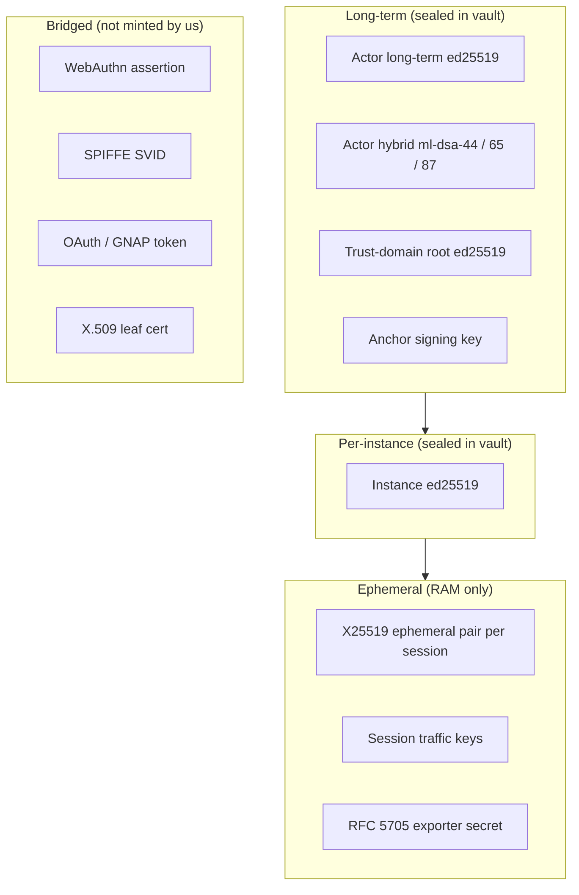
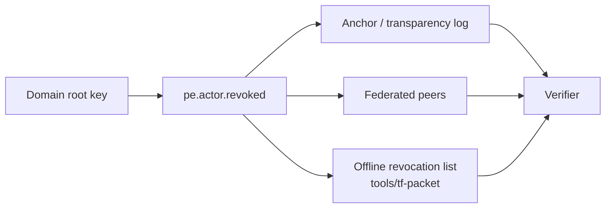

# Key handling

This page is the operator's guide to key material in TrustForge:
how keys are minted, where they are stored, how they rotate, how
they are revoked, and how they bind to hardware.

The normative form is in
[`../specs/TF-0002-actor-identity.md`](../specs/TF-0002-actor-identity.md)
(actor identity and key derivation) and
[`../specs/TF-0005-proof-events-ledgers.md`](../specs/TF-0005-proof-events-ledgers.md)
(proof event signing and revocation events). This page focuses on
the operational story.

## Key inventory

A TrustForge daemon holds the following classes of key.



## Generation

Keys are minted by the daemon, never by an external tool:

```bash
TF_VAULT_PASS=… tf actor create \
    --type service \
    --name tf-daemon \
    --domain example.com
```

This runs the same code path as the daemon's startup mint. It:

1. Generates a fresh ed25519 keypair using OS RNG via
   `ed25519-dalek`'s `rand_core` integration.
2. (If hybrid mode is enabled) generates a paired ml-dsa-44 keypair
   using `fips204`.
3. Computes the actor URI per
   [TF-0002 §3](../specs/TF-0002-actor-identity.md).
4. Seals both private keys in the vault file.
5. Emits `pe.actor.minted` to the local ledger.

Instance keys are minted lazily the first time the daemon boots in
a given environment (host, container, embedded device).

## Vault storage

Default location: `.tf/vault.tfvault`. The format is normative in
`schemas/vault-file.schema.json`. Operationally:

- The vault file is sealed with ChaCha20-Poly1305 keyed by Argon2id
  output of the operator passphrase.
- Argon2id parameters (memory, time, parallelism, salt) are stored
  in the vault header per
  `schemas/vault-file.schema.json#/properties/kdf`.
- Writes go through write-temp + `fsync` + rename
  (`vault-atomic-persist` mitigation).
- Each saved vault carries an integrity tag verified on load.
- The passphrase is taken from `TF_VAULT_PASS` (interactive prompt
  in development; secret-store integration in production —
  see [`../ops/configuration.md`](../ops/configuration.md)).

## Derivation paths

Each long-term ed25519 key is the root for derived keys per
TF-0002 §4:

- `instance/<host>/<session>` — instance binding.
- `proof/<class>` — domain-separated proof event signing.
- `bridge/<bridge-id>` — interop with external systems.
- `federation/<peer-domain>` — federation attestations.

Derivation uses SHA-512 → reduce-mod-l → scalar-multiply-base
(per ed25519 derivation conventions). Hybrid ml-dsa keys are
derived in parallel using FIPS 204 keygen with the derivation
input as seed.

## Rotation

Two rotation flows exist:

### Routine rotation

```bash
tf actor rotate --actor tf:actor:agent:example.com/code-helper
```

This:

1. Mints a new ed25519 (and ml-dsa) keypair for the actor.
2. Emits `pe.actor.rotated` linking old → new pubkey, signed by the
   trust-domain root key (per TF-0002 §6).
3. Marks the old keypair "superseded" in the vault but retains it
   for verifying historical proof events.
4. Federated peers see the rotation event and require explicit
   acknowledgement before they accept the new key
   (`federation-issuer-key-verify` mitigation).

### Emergency rotation (compromise)

```bash
tf actor revoke --actor … --reason key-compromise --emergency
tf actor rotate --actor … --emergency
```

In emergency mode:

1. Revocation is emitted **before** rotation so verifiers stop
   trusting the old key immediately.
2. The revocation is also packet-signed and broadcast to peers via
   any available carrier (live, packet, federation, anchor).
3. The runbook at [`../ops/runbook-incident.md`](../ops/runbook-incident.md)
   covers the surrounding steps (rotate vault passphrase, audit
   recent proof events, scope blast radius).

## Revocation

Revocation is a `pe.actor.revoked` proof event signed by the
trust-domain root and propagated through three channels:



The offline revocation list is the constrained-mode fallback (see
[`../profiles/constrained-profile.md`](../profiles/constrained-profile.md)):
a sealed, signed list with a freshness window that LoRa / sneakernet
verifiers honor. Implemented by
`OfflineRevocationListRuntime` in the TS stack and (planned for
v0.2) the Rust mirror.

## HSM and secure-element support

TrustForge supports keeping the long-term private key in hardware
via a pluggable signer interface:

- **macOS Keychain / Secure Enclave** — via the operator-side
  KeychainSigner; only ed25519 (Sequoia or platform-key-attached
  modes), not the hybrid path yet.
- **Linux TPM 2.0** — via `tpm2-pkcs11` or `tpm2-tss` bound to a
  signer plugin under `tools/native/`.
- **YubiHSM / Nitrokey HSM 2** — via PKCS#11.
- **Embedded secure elements** — see the embedded examples under
  `crates/embedded/`. The bootloader example
  (`crates/embedded/tf-bootloader-example/`) shows boot-time key
  binding.

Hardware-bound keys are referenced in the vault by a non-extractable
handle; the vault file holds metadata only, not the key bytes. The
threat-model entry `compromised TPM / HSM` (residual risk #2)
applies — if the hardware lies, signing collapses.

## Plugin keys

Plugins do not get long-term keys by default. A plugin manifest
(`schemas/plugin-manifest.schema.json`) declares which capabilities
it requires; the daemon issues a short-lived capability token bound
to the plugin's instance for each granted capability. Plugin
authors who want to sign their own proof events register a plugin
sub-actor under the daemon's domain and inherit a derived key.

## Federation keys

Each federated peer is identified by its domain root pubkey. The
`tf trust-domain federate` command takes a signed bundle from the
peer and pins the issuer keys under
`schemas/federation-attestation.schema.json`. Rotation requires:

1. The peer emits a `pe.federation.peer.rotation_announced` event.
2. The local operator runs
   `tf trust-domain federate --acknowledge-rotation`.
3. Until acknowledged, capabilities issued by the new key are
   refused.

## Key compromise: what is lost?

Different keys have different blast radii:

| Key class | Blast radius |
|---|---|
| Vault passphrase | Total — all sealed keys for this daemon. |
| Domain root ed25519 | Total — all actors in this trust domain. |
| Actor long-term ed25519 | All proof events and capabilities ever signed by this actor (until revoked). |
| Instance key | Sessions and packets from this specific instance. |
| Session traffic keys | The specific session (forward secrecy is not full PFS in 0.1.0; see TF-0003 §3.7). |
| Plugin capability token | The granted plugin capability for its short TTL. |

The runbook for each is in
[`../ops/runbook-incident.md`](../ops/runbook-incident.md).

## Embedded examples

For embedded operators, study these examples in the same order as
the constrained profile narrative:

1. `crates/embedded/tf-stm32wl-lora/` — sign-only LoRa node.
2. `crates/embedded/tf-rp2040-picow/` — Pi Pico W with WiFi carrier.
3. `crates/embedded/tf-esp32-wifi/` — ESP32 WiFi.
4. `crates/embedded/tf-nrf52-ble/` — Nordic BLE peripheral.
5. `crates/embedded/tf-avr-atmega328/` — minimal AVR demonstrator
   (ed25519 only, no hybrid).
6. `crates/embedded/tf-bootloader-example/` — signed-boot binding.

Each example documents its key-storage approach (flash region,
secure element, OTP fuses) in its README.
