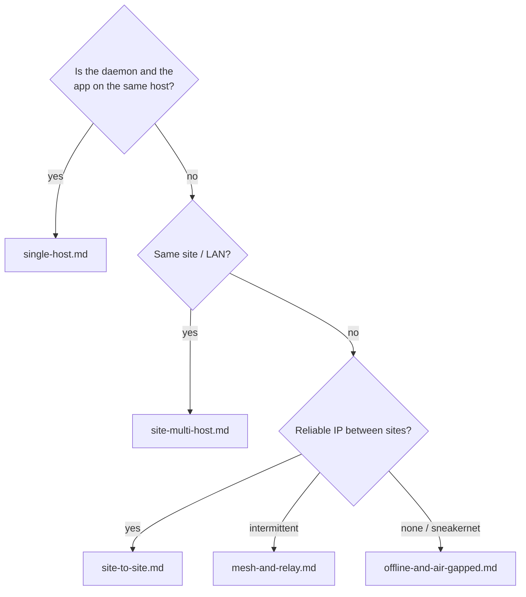
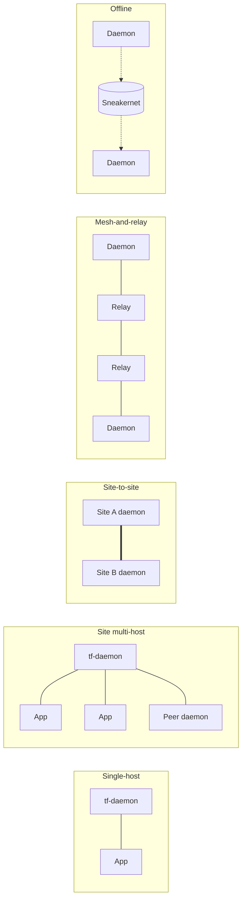

# Deployment topologies

A topology is the *physical and network shape* of a TrustForge
deployment: where the daemon runs, where applications run, what
crosses the network, and how trust extends between sites.

Topologies are orthogonal to profiles. A profile
([`../profiles/`](../profiles/)) controls which features are
required (E0–E5 enforcement, L0–L5 proof, MUST/SHOULD bridges).
A topology controls *how the deployment is laid out*. The same
profile can run in any topology; the same topology can be served
by any profile.

## What lives here

| Document | When to use |
|---|---|
| [`single-host.md`](single-host.md) | Daemon and applications on one machine — laptop, dev box, single-tenant server. |
| [`site-multi-host.md`](site-multi-host.md) | One trust domain spread across multiple hosts in a datacenter, cluster, or LAN. |
| [`site-to-site.md`](site-to-site.md) | Two sites that need to exchange traffic over a WAN; refers to [TF-0013](../specs/TF-0013-site-to-site-binary-path.md). |
| [`mesh-and-relay.md`](mesh-and-relay.md) | Many actors, partial connectivity, relays carrying packets they cannot decrypt. |
| [`offline-and-air-gapped.md`](offline-and-air-gapped.md) | Sneakernet, LoRa, BLE, store-and-forward, delayed delivery. |

## Choose-your-topology cheat sheet

These topologies are not mutually exclusive. A real deployment
typically combines two or three: e.g. a single-host development
laptop federating into a multi-host site, which exposes a
site-to-site binary path to a partner organization, while a fleet
of LoRa nodes delivers packets through a relay back to the same
site.

## Common ingredients

Regardless of topology, every deployment includes:

- A **daemon** (`tools/tf-daemon/`) holding the long-term keys for
  this domain or this host.
- A **vault** (`schemas/vault-file.schema.json`) sealed with
  Argon2id-stretched passphrase material.
- A **proof ledger** (one of `crates/tf-store-postgres`,
  `tf-store-sqlite`, or `tf-store-mysql`) appending hash-chained
  events.
- An optional **anchor** (RFC 6962 transparency log or RFC 3161
  timestamp authority) for higher proof levels.
- One or more **applications** that call the daemon's admin HTTP
  endpoint or are wrapped by an adapter under
  `tools/adapters/` or `crates/adapters/`.

## Network shapes at a glance

## Interaction with profiles

| Topology | Typical profile |
|---|---|
| Single-host | `tf-home-compatible` |
| Site multi-host | `tf-enterprise-compatible` |
| Site-to-site | `tf-enterprise-compatible` (or `tf-compliance-evidence-compatible` for legal evidence) |
| Mesh and relay | `tf-constrained-compatible` (often combined with `tf-enterprise-compatible` at the gateway) |
| Offline / air-gapped | `tf-constrained-compatible` |

The daemon refuses to boot if its claimed profile's MUST features
are not satisfied. See
[`../ops/configuration.md`](../ops/configuration.md) for the
profile assertion at startup and
[`../profiles/`](../profiles/) for normative profile definitions.

## Failure-domain rules

These rules apply to every topology and are reasons to prefer one
shape over another:

- **A vault must not span hosts.** Each host runs its own daemon
  with its own vault and instance keys. Vault sharing breaks the
  audit trail.
- **A trust-domain root key should not run hot.** In multi-host
  and site-to-site setups, the domain root key signs federation
  attestations and emergency revocations only — day-to-day
  operations use derived per-actor keys.
- **A relay is a first-class actor.** Even if it cannot decrypt the
  payloads it forwards, it must hold its own actor identity, sign
  `pe.packet.forwarded` events, and have its forwarding authority
  scoped (see [`mesh-and-relay.md`](mesh-and-relay.md)).
- **Federation is per-domain, not per-host.** When two sites want
  to exchange traffic, they federate the trust domains; individual
  hosts within each site inherit the federation through their
  domain root.

## Where to look for topology-specific configuration

- `.tf/daemon.yaml` — daemon configuration, the same shape across
  all topologies; what differs is which sections are populated.
- `.tf/policy.yaml` — policy file consumed by the policy engine;
  topology-independent.
- `.tf/profile.yaml` — the asserted profile; the daemon refuses to
  boot if MUST features are unmet.
- `.tf/agent-contract.yaml` — for AI-agent deployments.
- `.tf/threat-model.yaml` — repo-level threat model; per-deployment
  threat models are in additional files referenced by name.

See [`../ops/configuration.md`](../ops/configuration.md) for every
flag, env var, and file the daemon reads.
