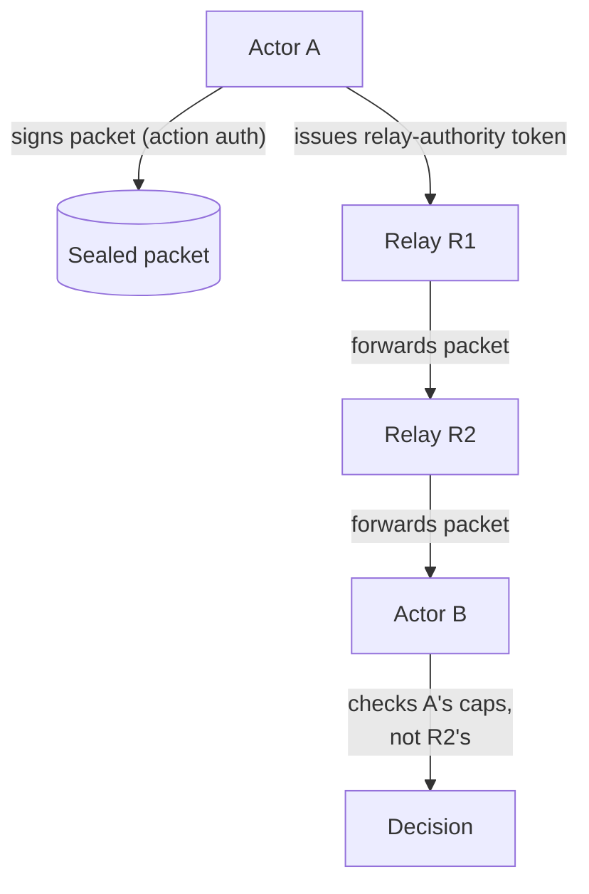
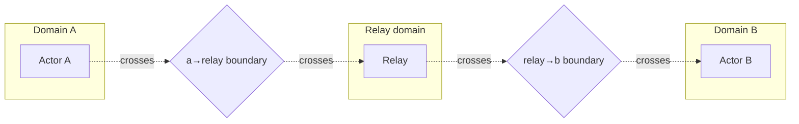

# Mesh and relay topology

Many actors with partial connectivity; relays carrying packets they
cannot decrypt. This is the topology that the constrained profile
(see [`../profiles/constrained-profile.md`](../profiles/constrained-profile.md))
was designed for and that the relay-as-first-class-actor concept
(see [`../concepts/relays-as-actors.md`](../concepts/relays-as-actors.md))
exists to support.

## When to use it

- LoRa / BLE / sub-GHz radio fleets where the network is
  intermittent and many hops carry traffic between endpoints.
- Federated chat / matrix-bridge deployments where home servers
  carry messages on behalf of users.
- Air-gapped sites that periodically connect through a transit
  node.
- Any scenario where the carrier must not be able to read the
  payload but must prove it carried the packet.

## When **not** to use it

- Reliable IP between every pair → use
  [`site-multi-host.md`](site-multi-host.md) or
  [`site-to-site.md`](site-to-site.md).
- Pure offline / sneakernet (no relays at all) →
  [`offline-and-air-gapped.md`](offline-and-air-gapped.md).

## Picture

```mermaid
flowchart LR
    subgraph Edges["Edges"]
        A[Actor A<br/>tf:actor:agent:a.example/x]
        B[Actor B<br/>tf:actor:agent:b.example/y]
    end
    subgraph Relays["Relays (cannot decrypt payload)"]
        R1[Relay R1<br/>tf:actor:relay:net.example/r1]
        R2[Relay R2<br/>tf:actor:relay:net.example/r2]
        R3[Relay R3<br/>tf:actor:relay:net.example/r3]
    end
    A -- sealed packet --> R1
    R1 -- sealed packet --> R2
    R2 -- sealed packet --> R3
    R3 -- sealed packet --> B
    R1 -. pe.packet.forwarded .-> Ledger[(Ledger / Anchor)]
    R2 -. pe.packet.forwarded .-> Ledger
    R3 -. pe.packet.forwarded .-> Ledger
```

The packet's payload is AEAD-sealed to B's recipient X25519 public
key. R1, R2, R3 see only the header (signing actor, recipient,
nonce, timestamp) and the opaque ciphertext. Each relay signs a
`pe.packet.forwarded` proof event with its own actor key,
attesting carriage without seeing plaintext.

## Two authorities, separately checked

The single most-violated rule in mesh deployments is:

> Forwarding authority and action authority are separate.

A relay carries a `relay-authority` token that authorises it to
forward packets from a class of senders to a class of recipients.
That token is **not** an action-authority token. The destination
checks the *signing* actor's capabilities, not the relay's
forwarding token, when deciding whether to act on the payload.

This is the `relay-forwarding-authority-split` mitigation in
`.tf/threat-model.yaml`.



If a relay is compromised, the worst it can do is:

- Refuse to forward (denial of service).
- Forward to extra recipients its `relay-authority` token allows
  (still bounded).
- Replay packets it already forwarded (caught by the
  `PacketReceiver` sliding-window nonce cache —
  `aead-nonce-discipline` planned mitigation, plus replay-attack
  defence today).

It cannot decrypt the payload, forge the sender's signature, or
cause the destination to act with the relay's authority.

## Sealed packets, in detail

The packet model lives in
[`../specs/TF-0003-proofwire-transport.md`](../specs/TF-0003-proofwire-transport.md)
§4 and is implemented in `tools/tf-packet/` (TS) and
`crates/tf-types/src/packet.rs` (Rust).

A sealed packet has:

- A clear header: `from`, `to`, `nonce`, `ts`, `caps`, `bridge_hint`.
- A signature over the canonical-JSON header || ciphertext.
- An AEAD-sealed payload: `X25519(ephemeral, recipient_pk) →
  HKDF-SHA256 → ChaCha20-Poly1305`.
- An optional fragmentation envelope (for LoRa MTUs).

A relay verifies the *signature* over the header and ciphertext
(so it knows the sender is real) but does not have the AEAD key.

## Carrier examples

The constrained profile specifies several carriers. Each is shown
in `crates/embedded/`:

| Carrier | Crate | Notes |
|---|---|---|
| LoRa (sub-GHz) | `tf-stm32wl-lora` | Includes a deterministic xorshift64* simulator for tests. |
| BLE | `tf-nrf52-ble` | Peripheral mode with packet fragmentation. |
| WiFi | `tf-esp32-wifi` | Higher-bandwidth mesh. |
| UART | `tf-esp32c3-uart` | Wired serial; useful as a bench testbed. |
| Sneakernet | (manual) | See [`offline-and-air-gapped.md`](offline-and-air-gapped.md). |

## Relay as a first-class actor

Each relay is **named** in the actor URI scheme:

- `tf:actor:relay:net.example/r1`

It has:

- Its own ed25519 keypair.
- Its own vault (or hardware-bound key on embedded relays).
- Its own emitted proof events (`pe.packet.forwarded`,
  `pe.packet.dropped` if relevant).
- Its own bridge if it talks to a non-TrustForge transport (e.g.
  Matrix relay → Matrix server).

Relays can compose: a chain of relays each signs a separate
`pe.packet.forwarded`, building a verifiable carriage chain.

## Trust boundaries



Each crossing is its own boundary. The relay's domain may be
federated with both A and B, neither, or one — the topology is
flexible. What matters is that the boundary checks are independent.

## Capacity and backpressure

A mesh deployment needs to plan for:

- **Packet TTL** — how long a relay holds a packet if the next hop
  is down. Default in 0.1.0: 30 minutes for `tf-constrained-compatible`.
- **Buffer caps** — `PacketReceiver` is sliding-window with LRU
  eviction; sized per device.
- **Replay window** — sized to bound buffer cost, default 1024
  outstanding nonces per sender.
- **Backpressure signals** — relays may emit `pe.packet.dropped` if
  the next hop is unreachable, so the sender can fall back to a
  different path.

## Conformance vectors

The relay forwarding behaviour is covered by
`conformance/relay-forwarding-vectors.yaml` and
`conformance/negative-capability-vectors.yaml`. Run
`tf-conformance run --suite relay` to validate.

## Profile compatibility

Mesh-and-relay is the home of `tf-constrained-compatible` (E3 / L1
floor, packet-mode primary, sealed payloads, offline revocation
list). Combine with `tf-enterprise-compatible` at a gateway daemon
that forwards into a fully-online site, where the gateway
re-emits the proof events with anchor inclusion.
