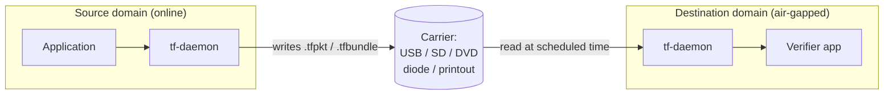

# Offline and air-gapped topology

Pure packet-mode delivery without live sessions. Used for
sneakernet (USB drives), one-way data diodes, periodic batch
delivery, courier networks, and air-gapped sites that cross a
boundary only on a schedule.

This is the strongest test of the
"Live Mode and Packet Mode are equally first-class" principle. A
deployment that works offline necessarily uses only the parts of
TrustForge that don't require a live channel.

## When to use it

- An air-gapped lab that periodically receives signed updates via
  optical media or one-way diode.
- Field teams uploading data via USB drive at the end of a shift.
- A backup or evidence pipeline where the destination must be
  isolated.
- Embedded fleets that occasionally connect to a base station and
  exchange backlogs.

## When **not** to use it

- Anything with reliable IP → use one of the live topologies.
- Intermittent but real network connectivity →
  [`mesh-and-relay.md`](mesh-and-relay.md).

## Picture



## Two artefacts you carry

Offline delivery uses two binary container formats from the 0.1.0
release (see CHANGELOG B15):

### `.tfpkt` — single packet

```text
+----------------+----------------------+----------------------+
| Magic ("TFPK") | u32 BE length        | CBOR-encoded Packet  |
+----------------+----------------------+----------------------+
```

Carries a single signed (and optionally sealed) packet.
Implementation: `tools/tf-packet/` (TS) and
`crates/tf-types/src/packet.rs` (Rust). Suitable for one
authenticated message at a time — e.g. a remote sensor's hourly
upload.

### `.tfbundle` — proof bundle

```text
+----------------+----------------+--------------------------+----------------+
| Magic ("TFBN") | u32 BE length  | CBOR ProofBundle[Encr.]  | sig trailer    |
+----------------+----------------+--------------------------+----------------+
```

Carries a batch of proof events (a slice of the ledger),
optionally AEAD-sealed to one or more recipient X25519 public
keys. Used for evidence delivery; see
[`../profiles/compliance-evidence-profile.md`](../profiles/compliance-evidence-profile.md).
Implementation: `tools/tf-evidence/`.

Both formats round-trip in TS (`cbor-x`) and Rust (`ciborium`).

## Sign and ship

```bash
# 1. On the source side, sign the packet.
tf packet sign \
    --from tf:instance:agent:source.example/sensor-1 \
    --to   tf:actor:service:dest.example/intake \
    --payload sensor-data.json \
    --out reading-2026-04-26T10.tfpkt

# 2. Move the .tfpkt over the carrier (USB, diode, etc.).

# 3. On the destination side, verify.
tf packet verify --in reading-2026-04-26T10.tfpkt
```

The verify step on the destination:

1. Reads the magic + length, then CBOR-decodes the `Packet`.
2. Verifies the ed25519 signature with the sender's pinned public
   key.
3. Checks the nonce against the sliding-window replay cache
   (`PacketReceiver`).
4. Checks the timestamp against the offline revocation list
   (`OfflineRevocationListRuntime`).
5. Decrypts the payload (if sealed).
6. Evaluates capabilities and emits `pe.packet.received`.

Each of these steps is offline. No external lookup is required.

## The offline revocation list

The single hardest problem in air-gapped TrustForge is *timely
revocation*: how does an offline destination learn that a key was
revoked yesterday, when the destination only sees the network once
a week?

The 0.1.0 answer is the `OfflineRevocationListRuntime`:

- A signed, sealed list of revocation events.
- A freshness window (`valid_from`, `valid_until`) signed by the
  trust-domain root.
- A "best by" semantic — past `valid_until`, the destination
  refuses to act on capabilities issued before `valid_until` until
  it gets a fresh list.

The destination operator carries fresh revocation lists alongside
the data they import. If the freshness window expires, all
incoming capability tokens fail closed. This is `E3`-level
enforcement at the destination.

## Air-gap one-way diode

For one-way diode environments (one direction of bytes only, no
ACKs), the relevant primitives are:

- `signDeliveryReceipt` / `verifyDeliveryReceipt` — the receiver
  signs a delivery receipt for each packet it actually accepted.
  Receipts are batched and carried back on the next inbound trip.
- `signProofOfForwarding` / `verifyProofOfForwarding` — a relay or
  diode operator can attest that a packet crossed the diode
  without seeing plaintext.

These are documented in CHANGELOG section B14 and live in
`tools/tf-packet/` (TS); the Rust mirror is on the v0.2 roadmap.

## Trust boundaries

```mermaid
flowchart LR
    Source[Source actor] -. R3 .-> Media{(Media boundary)}
    Media -. R3 .-> Dest[Destination actor]
    Source -. R4 .-> Federation[Federation peer pin]
    Federation -. R4 .-> Dest
```

The media itself is the new boundary. Specifically:

- A sneakernet courier can substitute the USB drive (file
  substitution attack). Mitigation: every `.tfpkt` and `.tfbundle`
  is signed; substitution is detected at verify.
- A diode can drop packets (denial of service). Mitigation:
  delivery receipts on the return path.
- Re-presenting an already-delivered packet (replay). Mitigation:
  `PacketReceiver` sliding-window cache.
- Stale revocation list (extending a revoked key's life).
  Mitigation: signed freshness window with fail-closed expiry.

## Carrier examples in the repo

- `tools/tf-packet/src/simulate-lora.ts` — LoRa channel simulator
  for offline development.
- `crates/embedded/tf-stm32wl-lora/` — real LoRa firmware that
  emits `.tfpkt` frames.
- `tools/tf-evidence/src/cli.ts` — `assemble`, `seal`, `open`,
  `replay` for `.tfbundle` files.

## Worked example: monthly compliance dump

A regulated org wants monthly evidence dumps from a production
network into an air-gapped audit network.

1. **Source side**: cron runs `tf evidence assemble --from
   2026-04-01 --to 2026-05-01 --recipients audit-network` once a
   month. The result is a `.tfbundle` sealed to the audit network's
   recipient pubkey, RFC 3161-anchored, with redactions per the
   org's data classification policy.
2. **Carrier**: copied to a write-once optical disc; chain-of-custody
   form signed by hand.
3. **Destination side**: the audit operator boots an air-gapped
   workstation, mounts the disc, runs `tf evidence verify`. The
   verifier checks the AEAD seal, the chain hash, the RFC 3161
   timestamp inclusion proof, and the per-event signatures.
4. **Auditor reads** the events through `tf evidence replay`,
   which renders them in narrative form.

Throughout this flow, no live network is involved.

## Profile compatibility

The combination is `tf-constrained-compatible` at the field side
and `tf-compliance-evidence-compatible` at the audit side. Both
require offline-aware primitives; both work without a live network
to the other.

## What 0.1.0 does not yet support

- Two-way diode protocols beyond delivery receipts. Fully
  bidirectional flows over a one-way diode are an active research
  area; the 0.1.0 spec gives you the building blocks but does not
  pretend to ship a finished product.
- Air-gap clock skew beyond 24 hours (the default tolerance is
  60s). Operations on schedules longer than that need explicit
  freshness windows on every outbound capability.
- Hardware seal verification (e.g. tamper-evident enclosure on the
  USB drive). Out of scope for 0.1.0; see the residual risks in
  [`../security/threat-model.md`](../security/threat-model.md).
