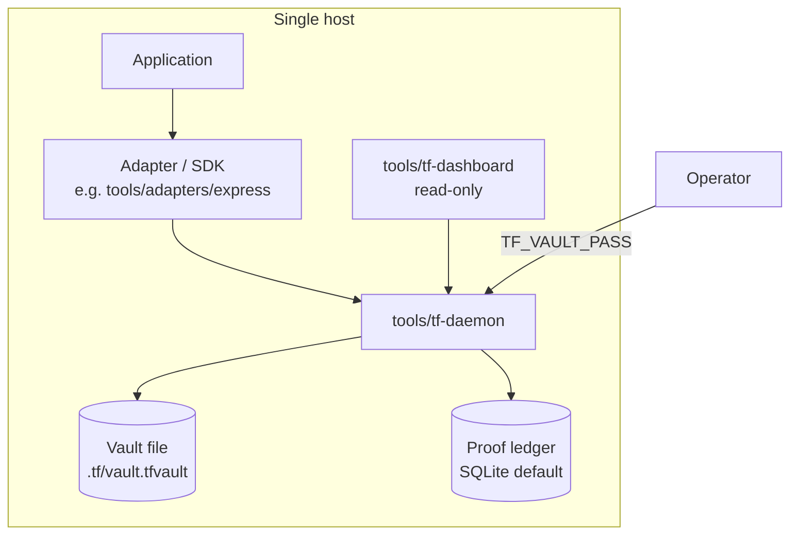
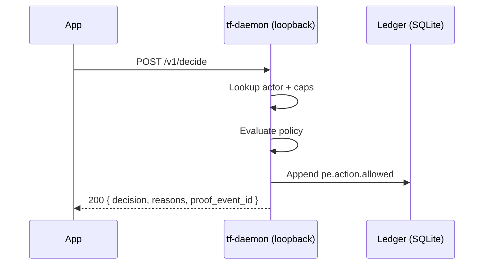

# Single-host topology

The simplest TrustForge deployment: a single machine runs the
daemon, the application(s), and (optionally) a viewer-only
dashboard. Suitable for development laptops, dev boxes,
single-tenant servers, home automation, and personal mesh
deployments.

This is the topology used in
[`../tutorials/01-getting-started.md`](../tutorials/01-getting-started.md).

## When to use it

- You are developing or experimenting with TrustForge.
- The daemon and the protected application are co-tenants — same
  user, same host, same trust boundary.
- You want a clean place to learn the surfaces (admin HTTP,
  ProofRPC, packet sign/verify) before scaling out.
- You are running a home or personal-mesh deployment under
  `tf-home-compatible`.

## When **not** to use it

- Multiple hosts in the same site → use
  [`site-multi-host.md`](site-multi-host.md).
- Two sites needing reliable WAN traffic → use
  [`site-to-site.md`](site-to-site.md).
- Constrained / occasionally-disconnected nodes → use
  [`offline-and-air-gapped.md`](offline-and-air-gapped.md).

## Picture



The daemon binds to loopback by default. The admin HTTP endpoint
listens on `127.0.0.1:8787` and accepts a bearer token from the
`TF_ADMIN_TOKEN` environment variable. Applications either:

1. Speak HTTP directly to the daemon admin API
   (`/v1/decide`, `/v1/proof/sign`, `/v1/proof/verify`,
   `/v1/import-credential`); or
2. Are wrapped by an adapter under `tools/adapters/` or
   `crates/adapters/` (Express, Remix, Axum, MCP, A2A) which calls
   the daemon for them.

## Boot sequence

```bash
# 1. Mint a daemon identity into the vault.
TF_VAULT_PASS=dev-pw bun run tools/tf-cli/src/cli.ts actor create \
    --type service --name tf-daemon --domain example.com

# 2. Boot the daemon.
TF_VAULT_PASS=dev-pw \
TF_ADMIN_TOKEN=$(openssl rand -hex 16) \
    bun run tools/tf-daemon/src/cli.ts run --config .tf/daemon.yaml

# 3. (Optional) Run the read-only dashboard.
TF_ADMIN_TOKEN=$TF_ADMIN_TOKEN \
    bun run tools/tf-dashboard/src/cli.ts --daemon http://127.0.0.1:8787
```

The minimal `.tf/daemon.yaml` for single-host:

```yaml
listen:
  admin: "127.0.0.1:8787"
  session: "127.0.0.1:8788"     # optional, for live-mode WS carrier
profile: "tf-home-compatible"
vault:
  path: ".tf/vault.tfvault"
ledger:
  backend: "sqlite"
  path: ".tf/ledger.db"
```

## Trust boundaries

Even in single-host, several trust boundaries apply:

- `host.filesystem` — what the daemon can read on disk under the
  agent contract.
- `daemon.admin.endpoint` — the admin HTTP socket. Bind to
  loopback only; never to `0.0.0.0` in single-host mode.
- `vault.passphrase` — protects long-term keys at rest.

See [`../security/threat-model.md`](../security/threat-model.md)
for the full list and mitigations.

## Loopback vs. UDS

By default the admin endpoint is loopback HTTP. For higher trust,
switch to a Unix domain socket so peer-credential authentication
binds tokens to the calling process:

```yaml
listen:
  admin: "unix:/run/trustforge/admin.sock"
```

Use UDS when the host is shared with other users; loopback HTTP is
fine on a single-user dev box. The planned mitigation
`daemon-admin-token-binding` in `.tf/threat-model.yaml` will tie
admin tokens to either UDS peer-credential or loopback origin.

## Lifecycle of a request

For an application sending a `/v1/decide` query:



Latency in single-host is dominated by SQLite append (sub-ms on
SSD). For higher throughput, switch the ledger backend to Postgres
(see [`site-multi-host.md`](site-multi-host.md)).

## Backup

A single-host backup needs three artefacts:

1. The vault file (`.tf/vault.tfvault`).
2. The ledger (`.tf/ledger.db`).
3. The configuration (`.tf/*.yaml`).

The vault passphrase is held only by the operator; it is **not**
in the backup. See
[`../ops/disaster-recovery.md`](../ops/disaster-recovery.md) for
the recovery procedure.

## Migration paths

When you outgrow single-host, the next step is usually
[`site-multi-host.md`](site-multi-host.md). The migration is:

1. Stand up a second daemon on a second host.
2. Federate the second daemon under the same trust domain
   (it inherits the domain root pubkey from the first daemon).
3. Move the application(s) onto the second host.
4. Decommission the first daemon (or keep it as a peer).

The existing proof ledger continues to verify because actor URIs
do not change.

## Profile compatibility

Single-host typically pairs with `tf-home-compatible`:

- E3 enforcement floor (deny-by-default, capability tokens
  required, proof events emitted).
- L1 proof floor (signed event chain, no anchor required).

For higher assurance on a single host (e.g. compliance evidence on
a developer laptop), bump the profile to
`tf-compliance-evidence-compatible` and configure an external
RFC 3161 / RFC 6962 anchor. The architecture does not change; only
the proof level rises.
