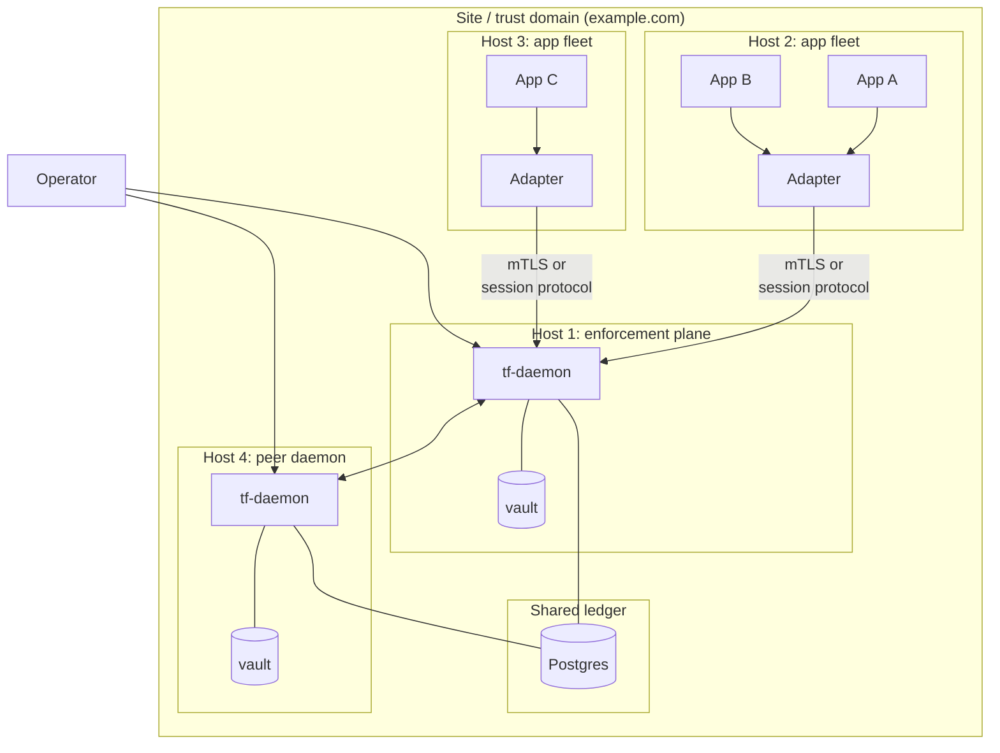
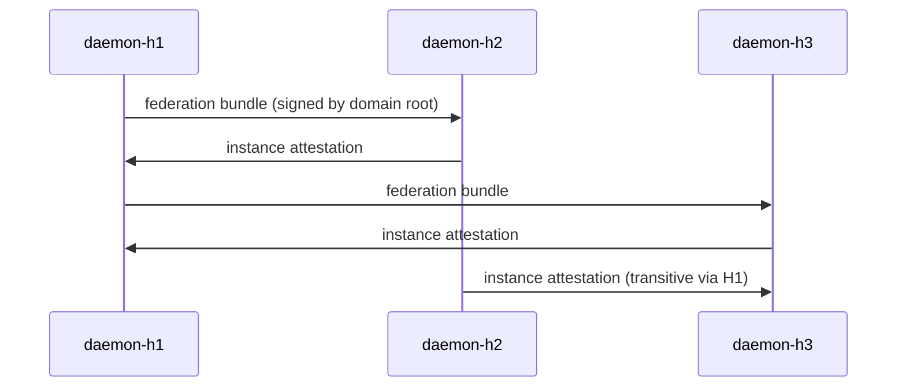

# Site / multi-host topology

A single trust domain spread across several hosts in one site
(datacenter, cluster, LAN, building). The daemon runs as the
enforcement plane; applications run on different hosts and reach the
daemon over loopback (when colocated) or a private network. Lateral
peer daemons may federate within the same trust domain or across
domains.

## When to use it

- You have a fleet of services in one site that should share a
  policy and a proof ledger.
- Several apps want to call `/v1/decide` and emit proof events
  centrally.
- You need horizontal scale beyond what a single SQLite ledger can
  serve.

## When **not** to use it

- One host → [`single-host.md`](single-host.md).
- Cross-site WAN traffic → [`site-to-site.md`](site-to-site.md).
- Partial connectivity / occasionally disconnected nodes →
  [`mesh-and-relay.md`](mesh-and-relay.md) and
  [`offline-and-air-gapped.md`](offline-and-air-gapped.md).

## Picture



Two key points:

- **One trust domain, several daemons.** Each daemon has its own
  vault and instance keys but they share the trust domain root.
  Day-to-day actor minting is delegated to per-daemon sub-issuers.
- **Shared ledger.** Postgres (or MySQL) backs the proof event log
  so every daemon sees the same chain.

## Boot sequence (host 1, then host 2)

```bash
# Host 1: mint domain root + daemon identity.
TF_VAULT_PASS=… tf trust-domain init --domain example.com
TF_VAULT_PASS=… tf actor create --type service --name daemon-h1 --domain example.com

# Host 1: boot the daemon against shared Postgres.
TF_VAULT_PASS=… TF_ADMIN_TOKEN=… \
    tf-daemon run --config /etc/trustforge/daemon.yaml

# Host 2 onward: each daemon needs its own vault + instance key,
# bootstrapped from a federation bundle minted by host 1.
TF_VAULT_PASS=… tf actor create --type service --name daemon-h2 --domain example.com
TF_VAULT_PASS=… tf-daemon run --config /etc/trustforge/daemon.yaml
```

A multi-host `daemon.yaml`:

```yaml
listen:
  admin: "10.0.0.10:8787"
  session: "10.0.0.10:8788"
profile: "tf-enterprise-compatible"
vault:
  path: "/etc/trustforge/vault.tfvault"
ledger:
  backend: "postgres"
  url: "postgres://tf:…@10.0.0.20/tf_ledger"
revocation:
  backend: "redis"
  url: "redis://10.0.0.21:6379/0"
federation:
  peers:
    - bundle: "/etc/trustforge/peer-bundles/host3.bundle"
    - bundle: "/etc/trustforge/peer-bundles/host4.bundle"
anchors:
  rfc6962:
    enabled: true
    log_url: "https://ct.example.com"
```

## How apps talk to the daemon

Three options, in order of preference:

### 1. Loopback or UDS (colocated)

If the app is on the same host as a daemon, the adapter calls the
admin HTTP endpoint over loopback or a Unix domain socket. Same
trust boundary as single-host.

### 2. mTLS over the LAN (separated)

If the app is on a different host, the daemon's session listener
serves the live-mode protocol (TF-0003 §3) and the adapter
authenticates with its own actor identity. The adapter holds an
instance key issued under a sub-actor of the app's service.

### 3. Session protocol over loopback to a sidecar (recommended for clusters)

For Kubernetes-style clusters, run a `tf-daemon` sidecar in the
pod. Apps speak loopback to the sidecar; sidecars federate among
themselves over the cluster network. This is the
"daemon-as-enforcement-plane" pattern referenced from the top of
this page.

## Lateral federation within a site



Within a single domain, lateral federation is metadata-only — each
daemon trusts the same root, so it just needs to learn the others'
instance pubkeys. Cross-domain federation (where two domains
intentionally peer) is the same flow but signed by **each**
domain's root.

## Trust boundaries that change

Compared to single-host, multi-host adds:

- The LAN itself is now a network boundary. The session protocol
  AEAD frames (`agent.to.agent.session` boundary) defend it.
- Postgres / Redis become a `host.filesystem` analogue — the
  daemon trusts the DB to faithfully append. The
  `transparency.anchor` mitigation is what prevents a malicious DB
  operator from quietly rewriting the ledger.
- Federation peers within the site share the domain root, so a
  compromised daemon in the same domain has the same blast radius
  as a compromised actor (R4).

## Scaling out the ledger

The three backends behave differently under load:

| Backend | Throughput | Operability |
|---|---|---|
| `tf-store-sqlite` | Single-writer; fine up to ~1 kHz events. | One file; no DBA. |
| `tf-store-postgres` | Multi-writer with row-level locks; ~10–50 kHz. | Standard DBA. |
| `tf-store-mysql` | Similar to Postgres. | If Postgres isn't an option. |

For very high event rates, partition by actor or trust domain;
each daemon writes to its own table, periodically merging into a
canonical chain. This is a v0.2 feature — in 0.1.0, a single
shared chain is the model.

## Profile compatibility

Multi-host typically pairs with `tf-enterprise-compatible`:

- E4 enforcement floor (negative capabilities required, ApprovalQueue
  for high-risk actions, federation-attestation pins).
- L2 proof floor with RFC 6962 anchoring.

If the site needs to produce legal evidence, layer
`tf-compliance-evidence-compatible` on top: same topology, but
RFC 3161 timestamping and L4/L5 proof are added.

## Operational concerns

- **Time sync.** Multi-host needs NTP / chrony with bounded skew
  (default 60s tolerance per `clock-skew-tolerance` mitigation).
- **Vault passphrase rotation.** Done per-host; vaults are not
  shared.
- **Backup.** Postgres backup + each host's vault file +
  `.tf/*.yaml`. See
  [`../ops/disaster-recovery.md`](../ops/disaster-recovery.md).
- **Observability.** Run Prometheus scraping the daemon
  `/metrics` endpoint; OTLP traces flow to a single collector.
  See [`../ops/observability.md`](../ops/observability.md).
