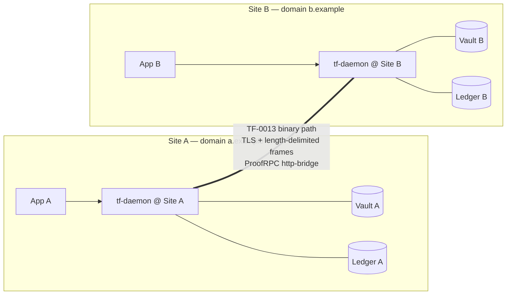
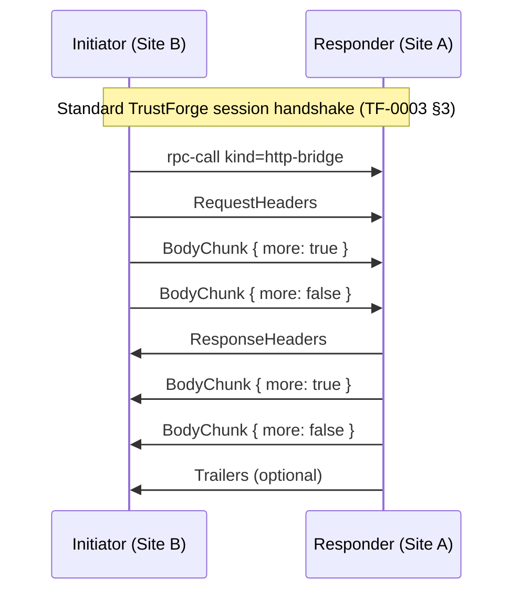

# Site-to-site topology

Two TrustForge-enabled sites, each its own trust domain, exchanging
traffic over a WAN. The normative spec is
[TF-0013 — Site-to-Site Binary Path](../specs/TF-0013-site-to-site-binary-path.md).
This page is the deployment-shape commentary.

The "binary path" of TF-0013 is a length-delimited TCP/TLS framing
plus a specialized ProofRPC method kind, `http-bridge`, that carries
HTTP/1.1 or HTTP/2 semantics inside a TrustForge session. The
result: an authenticated, identity-asserted tunnel between sites
without dragging in a full VPN or service-mesh substrate.

## When to use it

- Two organizations (or two regions of the same organization) that
  want to expose APIs to each other under TrustForge identity.
- An on-prem site and a cloud site that need a controlled,
  auditable HTTP path between them.
- A CI fleet calling into a customer site under a
  capability-bounded path.

## When **not** to use it

- One organization, one site, multiple hosts → use
  [`site-multi-host.md`](site-multi-host.md).
- Many partial-connectivity nodes →
  [`mesh-and-relay.md`](mesh-and-relay.md).
- Bulk file transfer where HTTP semantics are unnecessary —
  consider the `bulk-transfer` ProofRPC method kind directly.

## Picture



## Boot sequence

Pre-requisite: each site has its own trust-domain root, federated
with the other.

```bash
# Site A: federate with Site B by importing B's bundle.
tf trust-domain federate --bundle /etc/trustforge/peers/b.bundle

# Site A: configure the binary-path listener.
# In daemon.yaml on Site A:
listen:
  binary_path:
    bind: "0.0.0.0:8443"
    tls:
      cert: "/etc/trustforge/certs/a.example.crt"
      key:  "/etc/trustforge/certs/a.example.key"
profile: "tf-enterprise-compatible"

# Site B: dial Site A and declare the bridge.
# In daemon.yaml on Site B:
binary_path_clients:
  - peer: "tf:domain:a.example"
    address: "tcp://a.example:8443"
    tls: { ca: "/etc/trustforge/peers/a.crt" }
    bridges:
      - name: "http.api"
        capability: "http.api"
```

## Binary-path framing (TF-0013 §2)

Every frame on the binary path is:

```text
+----------------------------+--------------------------------+
| Length (32-bit BE, 4 bytes)| Payload (N bytes)              |
+----------------------------+--------------------------------+
```

- **Length**: big-endian unsigned 32-bit, max default 1 MiB.
- **Payload**: the canonical-JSON handshake frame (during
  handshake) or the AEAD-encrypted data frame (after handshake).

Implementations SHOULD enforce the maximum frame size to avoid
memory-exhaustion attacks. The `tf-session` Rust crate
(`crates/tf-session/`) implements the carrier; the daemon
(`tools/tf-daemon/`) wires it to the binary-path listener and the
`http-bridge` method dispatch.

## `http-bridge` method kind (TF-0013 §3)

A ProofRPC service descriptor declares a site-to-site bridge with
`kind: http-bridge`:

```json
{
  "name": "http.api",
  "kind": "http-bridge",
  "capability": "http.api",
  "description": "Cross-site HTTP tunnel"
}
```

The stream carries `HttpFrame` objects:

- `RequestHeaders` — initiator-only first frame: `method`, `path`,
  `headers`.
- `ResponseHeaders` — responder-only: `status`, `headers`.
- `BodyChunk` — either side, `data` is base64-encoded binary.
- `Trailers` — either side, optional HTTP trailers.

State machine (TF-0013 §4):



Either side sends a frame with `more: false` to signal end-of-stream.

## Trust boundaries crossed

A single binary-path call crosses three boundaries:

- `agent.to.agent.session` — the live session protocol underneath
  the binary path. AEAD-protects every frame.
- `federation.peer` — the calling site's domain root key was
  pinned at federation time. Capability inflation here would let
  one site issue tokens that the other accepts wholesale.
- `daemon.admin.endpoint` (on each side) — admin endpoint
  exposure on each side is independent and lives behind its own
  loopback / UDS.

## Profile and conformance

Site-to-site is most often run under
`tf-enterprise-compatible` (E4 / L2 with RFC 6962 anchoring). For
deployments that produce legal evidence of the cross-site call,
upgrade to `tf-compliance-evidence-compatible` (E4 / L3 + RFC 3161
+ RFC 6962); the binary path still carries the same HTTP, but each
RPC emits anchored proof events.

The conformance vectors for TF-0013 are part of the
`tf-conformance run` pipeline. Both sites must speak the same
framing and method-kind dispatch — the parity vectors guarantee
TS↔Rust compatibility.

## Failure modes

| Symptom | Likely cause |
|---|---|
| Handshake completes, `http-bridge` rejected at responder. | Capability `http.api` not granted to the initiator's actor. Check the policy on the responder. |
| Frames truncated mid-stream. | A network device with frame-size limits; raise the responder's max frame size or split body chunks. |
| Random session resets. | Clock skew exceeding the 60s tolerance window; check NTP. |
| `pe.federation.peer.rotation_announced` event blocking calls. | Peer rotated their root key; run `tf trust-domain federate --acknowledge-rotation`. |

## Why not just a VPN?

A site-to-site VPN gets you a network-layer tunnel; it does not get
you:

- Per-call authority (capability tokens scoped to a specific HTTP
  path or method).
- Per-call audit (signed proof event per request).
- Negative capabilities (a path the initiator must never reach).
- Bridge integration (the same `http-bridge` can authenticate via
  SPIFFE, OAuth, or WebAuthn at the application boundary).

If you want only "encrypted point-to-point IP", a VPN is fine. If
you want "authenticated, capability-gated, audited HTTP between
two organizations", that is what TF-0013 exists for.

## Future work

- HTTP/2 multiplexing inside a single binary-path session is the
  obvious next step. 0.1.0 supports HTTP/1.1 semantics over the
  bridge with one in-flight request per ProofRPC stream; many
  streams can run in parallel.
- Streaming RPC kinds (`server-streaming`, `bidi-streaming`) over
  the binary path are already wired by the underlying ProofRPC
  framing; the `http-bridge` kind sits alongside them.

See [TF-0013](../specs/TF-0013-site-to-site-binary-path.md) for the
normative state machine, error envelopes, and security
considerations.
