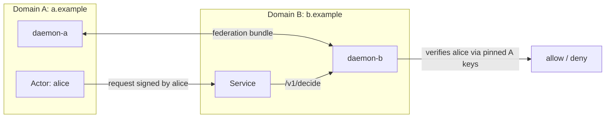

# 05 — Federation

Goal: stand up two TrustForge trust domains on one machine and
federate them so that an actor in domain A can be authorised by
the daemon in domain B. About 35 minutes.

By the end you will have:

- Two daemons: `daemon-a` for `tf:domain:a.example`, `daemon-b`
  for `tf:domain:b.example`.
- A federation bundle exchanged in both directions.
- An actor in A whose actions are correctly authorised by B.
- A simulated key rotation, acknowledged by the peer.

This tutorial assumes you have completed
[01 Getting started](01-getting-started.md) and have read
[04 Policy authoring](04-policy-authoring.md). It does not
require tutorial 02 or 03.

## Picture



## Step 1 — Mint two domain roots

Use two separate config directories so the daemons do not stomp
each other:

```bash
mkdir -p .tf-a .tf-b

TF_VAULT_PASS=dev-pw \
    bun run tools/tf-cli/src/cli.ts trust-domain init \
    --domain a.example \
    --config-dir .tf-a

TF_VAULT_PASS=dev-pw \
    bun run tools/tf-cli/src/cli.ts trust-domain init \
    --domain b.example \
    --config-dir .tf-b
```

Each command mints:

- A trust-domain root ed25519 + ml-dsa-44 keypair.
- A `pe.domain.minted` proof event.
- A federation bundle (signed by the root) exportable for peers.

Confirm:

```bash
ls .tf-a/
# vault.tfvault, ledger.db, daemon.yaml, federation-bundle.json
ls .tf-b/
# same
```

## Step 2 — Mint a daemon identity per domain

```bash
TF_VAULT_PASS=dev-pw \
    bun run tools/tf-cli/src/cli.ts actor create \
    --type service --name daemon --domain a.example \
    --config-dir .tf-a

TF_VAULT_PASS=dev-pw \
    bun run tools/tf-cli/src/cli.ts actor create \
    --type service --name daemon --domain b.example \
    --config-dir .tf-b
```

## Step 3 — Boot two daemons on different ports

`.tf-a/daemon.yaml`:

```yaml
listen:
  admin: "127.0.0.1:8787"
  session: "127.0.0.1:8788"
profile: "tf-enterprise-compatible"
vault: { path: ".tf-a/vault.tfvault" }
ledger: { backend: "sqlite", path: ".tf-a/ledger.db" }
```

`.tf-b/daemon.yaml`:

```yaml
listen:
  admin: "127.0.0.1:8797"
  session: "127.0.0.1:8798"
profile: "tf-enterprise-compatible"
vault: { path: ".tf-b/vault.tfvault" }
ledger: { backend: "sqlite", path: ".tf-b/ledger.db" }
```

In two terminals:

```bash
# Terminal 1
TF_VAULT_PASS=dev-pw TF_ADMIN_TOKEN_A=$(openssl rand -hex 16) \
    TF_ADMIN_TOKEN=$TF_ADMIN_TOKEN_A \
    bun run tools/tf-daemon/src/cli.ts run --config .tf-a/daemon.yaml

# Terminal 2
TF_VAULT_PASS=dev-pw TF_ADMIN_TOKEN_B=$(openssl rand -hex 16) \
    TF_ADMIN_TOKEN=$TF_ADMIN_TOKEN_B \
    bun run tools/tf-daemon/src/cli.ts run --config .tf-b/daemon.yaml
```

Save both admin tokens; you will need them.

## Step 4 — Exchange federation bundles

```bash
# A → B
bun run tools/tf-cli/src/cli.ts trust-domain federate \
    --bundle .tf-a/federation-bundle.json \
    --config-dir .tf-b

# B → A
bun run tools/tf-cli/src/cli.ts trust-domain federate \
    --bundle .tf-b/federation-bundle.json \
    --config-dir .tf-a
```

Each command:

1. Validates the bundle's signature against the included issuer
   key (`federation-issuer-key-verify` mitigation).
2. Pins the peer's domain root pubkey with an explicit `kid`.
3. Emits `pe.federation.peer.added` to the local ledger.

Verify:

```bash
bun run tools/tf-cli/src/cli.ts trust-domain verify-federation \
    --config-dir .tf-a
# peer: tf:domain:b.example  kid: <…>  status: acknowledged

bun run tools/tf-cli/src/cli.ts trust-domain verify-federation \
    --config-dir .tf-b
# peer: tf:domain:a.example  kid: <…>  status: acknowledged
```

## Step 5 — Mint a cross-domain actor

Create Alice in domain A:

```bash
TF_VAULT_PASS=dev-pw \
    bun run tools/tf-cli/src/cli.ts actor create \
    --type human --name alice --domain a.example \
    --attribute trust_level=4 \
    --config-dir .tf-a
```

The mint event is signed by domain A's root, so domain B's
daemon — having pinned A's root — can verify Alice's identity
without ever talking to domain A directly.

## Step 6 — Author a policy in domain B that grants A's actor

Edit `.tf-b/policy.yaml`:

```yaml
engine: cedar
schema: |
  entity Action;
  entity Actor;
  entity Target;
rules: |
  permit (
    principal == Actor::"tf:actor:human:a.example/alice",
    action == Action::"doc.read",
    resource
  );
```

Reload domain B's policy:

```bash
curl -X POST http://127.0.0.1:8797/v1/policy/reload \
    -H "Authorization: Bearer $TF_ADMIN_TOKEN_B"
```

## Step 7 — Decide cross-domain

Domain B can now decide for an actor in domain A:

```bash
curl -s http://127.0.0.1:8797/v1/decide \
    -H "Authorization: Bearer $TF_ADMIN_TOKEN_B" \
    -H "Content-Type: application/json" \
    -d '{
      "actor":  "tf:actor:human:a.example/alice",
      "action": "doc.read",
      "target": "doc:welcome"
    }' | jq .
# { "decision": "allow", "reasons": ["…"], "proof_event_id": "…" }
```

The proof event is recorded in domain B's ledger; domain A is
unaware of this specific decision (each domain maintains its own
ledger). For shared evidence, see
[`08-evidence.md`](08-evidence.md).

## Step 8 — Simulate a rotation

Rotate domain A's root key:

```bash
TF_VAULT_PASS=dev-pw \
    bun run tools/tf-cli/src/cli.ts actor rotate \
    --actor tf:domain:a.example \
    --config-dir .tf-a
```

A's daemon emits `pe.federation.peer.rotation_announced` and
publishes a new bundle. B's daemon will refuse new actions signed
under the new key until the operator acknowledges:

```bash
# Try to decide for an actor under the new key — denied.
# Acknowledge:
bun run tools/tf-cli/src/cli.ts trust-domain federate \
    --bundle .tf-a/federation-bundle.json \
    --acknowledge-rotation \
    --config-dir .tf-b
```

Confirm:

```bash
bun run tools/tf-cli/src/cli.ts trust-domain verify-federation \
    --config-dir .tf-b
# peer: tf:domain:a.example  kid: <new>  status: acknowledged
```

This is the `federation-issuer-key-verify` mitigation in
practice: rotations are explicit, never silent.

## Step 9 — Revoke a federated actor

If Alice's key is compromised, A revokes:

```bash
TF_VAULT_PASS=dev-pw \
    bun run tools/tf-cli/src/cli.ts revoke \
    actor tf:actor:human:a.example/alice \
    --reason key-compromise \
    --emergency \
    --config-dir .tf-a
```

The revocation event is signed by domain A's root and propagates
through every available carrier (live, packet, federation,
anchor). Once B receives it, subsequent decisions for Alice fail
closed.

You can demonstrate this immediately by running the same
`/v1/decide` call as in step 7 — the response is now `deny` with
reason `actor revoked`.

## Step 10 — Cross-domain via packet mode

Federation also works without live connectivity. Alice can sign
a packet for a service in B; B verifies it offline because B has
already pinned A's root key:

```bash
echo '{"action":"doc.read","target":"doc:welcome"}' > /tmp/payload.json

TF_VAULT_PASS=dev-pw \
    bun run tools/tf-cli/src/cli.ts packet sign \
    --from tf:instance:human:a.example/alice/laptop \
    --to   tf:actor:service:b.example/intake \
    --payload /tmp/payload.json \
    --out /tmp/cross.tfpkt \
    --config-dir .tf-a

bun run tools/tf-cli/src/cli.ts packet verify \
    --in /tmp/cross.tfpkt \
    --config-dir .tf-b
```

Verify succeeds because B has pinned A's root and can chain
Alice's signature through the public key included in her actor
identity bundle.

## What you have learned

- Federation is two trust domains pinning each other's root keys
  with explicit `kid` binding.
- Rotations are never silent. Operators must acknowledge.
- Cross-domain decisions and revocations work in both live mode
  (HTTP / session) and packet mode (offline `.tfpkt`).
- Every domain maintains its own ledger; cross-domain audit
  works through proof bundles (tutorial 08).

## What to read next

- [07 Bridges](07-bridges.md) — federate with non-TrustForge
  systems via SPIFFE, OAuth, WebAuthn.
- [08 Evidence](08-evidence.md) — share audit artefacts across
  domains.
- [`../topologies/site-to-site.md`](../topologies/site-to-site.md)
  — wire the federated daemons across a real WAN with TF-0013.
