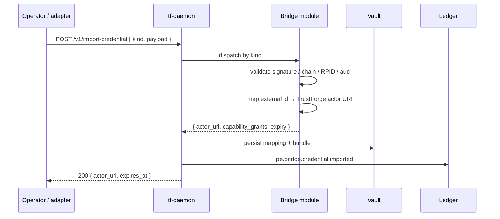

# 07 — Bridges (OAuth, SPIFFE, TLS)

Goal: import three external credentials into TrustForge: an
OAuth access token, a SPIFFE SVID, and a TLS leaf certificate.
Each becomes a TrustForge actor URI you can use in policy. About
40 minutes.

By the end you will have:

- An OAuth-bridged actor with attributes from the access token.
- A SPIFFE-bridged actor representing a workload.
- A TLS-bridged actor representing a peer service identified by
  cert.

This tutorial assumes you have completed
[01 Getting started](01-getting-started.md) and have a daemon
running. It is independent of tutorials 02–06.

## The bridges

The full list of compatibility bridges in 0.1.0:

| Bridge | Spec |
|---|---|
| WebAuthn (FIDO2) | [`../bridges/webauthn-bridge.md`](../bridges/webauthn-bridge.md) |
| SPIFFE | [`../bridges/spiffe-bridge.md`](../bridges/spiffe-bridge.md) |
| OAuth + GNAP + DPoP | [`../bridges/oauth-gnap-bridge.md`](../bridges/oauth-gnap-bridge.md) |
| MCP / A2A | [`../bridges/mcp-a2a-bridge.md`](../bridges/mcp-a2a-bridge.md) |
| TLS / mTLS / DID / Matrix | [`../bridges/tls-did-matrix-bridge.md`](../bridges/tls-did-matrix-bridge.md) |
| Webhook | (under MCP/A2A) |
| gRPC + service mesh | (under SPIFFE / TLS) |

We will exercise three: OAuth, SPIFFE, TLS. The others follow
the same shape (`/v1/import-credential` plus a per-bridge
schema).

## How a bridge import works



After import, downstream layers see only the TrustForge actor
URI. The original credential is held in the vault for refresh /
re-verification.

## Step 1 — Import an OAuth access token

Stand up a tiny mock OAuth issuer (for the tutorial; in
production this is your real issuer):

```bash
bun run tools/native/mock-oauth-issuer/cli.ts \
    --port 4444 \
    --client-id tutorial-client \
    --user alice@example.com
```

The mock issuer prints an access token (JWT) and the issuer
metadata URL.

Configure the daemon to trust this issuer. Edit `.tf/daemon.yaml`
and add a `bridges.oauth` section:

```yaml
bridges:
  oauth:
    issuers:
      - id: "tutorial-issuer"
        metadata_url: "http://127.0.0.1:4444/.well-known/openid-configuration"
        actor_uri_template: "tf:actor:human:example.com/{sub}"
```

Reload the daemon. Then import the token:

```bash
ACCESS_TOKEN=$(curl -s http://127.0.0.1:4444/token | jq -r .access_token)

curl -s http://127.0.0.1:8787/v1/import-credential \
    -H "Authorization: Bearer $TF_ADMIN_TOKEN" \
    -H "Content-Type: application/json" \
    -d "{
      \"kind\": \"oauth\",
      \"issuer\": \"tutorial-issuer\",
      \"access_token\": \"$ACCESS_TOKEN\"
    }" | jq .
# { "actor_uri": "tf:actor:human:example.com/alice@example.com",
#   "expires_at": "…",
#   "proof_event_id": "…" }
```

The bridge:

1. Validated the JWT signature against the issuer's JWKS.
2. Validated `aud`, `iss`, `exp`, `nbf`.
3. Mapped `sub` to a TrustForge actor URI.
4. Persisted the mapping and emitted
   `pe.bridge.credential.imported`.

DPoP and PKCE are supported on the OAuth path; see the bridge
spec.

## Step 2 — Use the OAuth-bridged actor in a decision

```bash
curl -s http://127.0.0.1:8787/v1/decide \
    -H "Authorization: Bearer $TF_ADMIN_TOKEN" \
    -H "Content-Type: application/json" \
    -d '{
      "actor":  "tf:actor:human:example.com/alice@example.com",
      "action": "doc.read",
      "target": "doc:welcome"
    }' | jq .
```

If your policy permits Alice (see tutorial 04), the decision is
allow. The proof event records that the actor identity came from
the OAuth bridge — auditors can trace back to the original JWT.

## Step 3 — Import a SPIFFE SVID

Stand up a mock SPIFFE workload server:

```bash
bun run tools/native/mock-spiffe-server/cli.ts \
    --port 4500 \
    --trust-domain workloads.example
```

The mock prints a workload SVID (an X.509 cert with a SPIFFE
URI in SAN) signed by a per-trust-domain CA.

Configure the daemon's SPIFFE bridge:

```yaml
bridges:
  spiffe:
    federations:
      - trust_domain: "spiffe://workloads.example"
        bundle_url: "http://127.0.0.1:4500/bundle"
        actor_uri_template: "tf:actor:service:workloads.example{path}"
```

Reload, then import:

```bash
SVID_PEM=$(curl -s http://127.0.0.1:4500/svid)

curl -s http://127.0.0.1:8787/v1/import-credential \
    -H "Authorization: Bearer $TF_ADMIN_TOKEN" \
    -H "Content-Type: application/json" \
    -d "{
      \"kind\": \"spiffe-svid\",
      \"svid_pem\": $(jq -Rs <<< "$SVID_PEM")
    }" | jq .
# { "actor_uri": "tf:actor:service:workloads.example/api/v1",
#   "expires_at": "…", "proof_event_id": "…" }
```

The bridge validated the cert chain against the federated
SPIFFE bundle and mapped the SPIFFE URI (`spiffe://…`) to a
TrustForge actor URI per the template.

## Step 4 — Service-mesh integration

The SPIFFE bridge accepts XFCC headers (Envoy's
`x-forwarded-client-cert`), Istio mTLS metadata, and Linkerd's
`l5d-client-id` header. Adapters under
[`../../tools/adapters/`](../../tools/adapters/) (and the
`crates/adapters/` Rust mirror) parse these and call the SPIFFE
bridge automatically. Wire it into your existing service mesh
without changing application code; see the SPIFFE bridge spec
for the per-mesh recipes.

## Step 5 — Import a TLS leaf certificate

Generate a self-signed cert for the tutorial:

```bash
openssl req -x509 -newkey rsa:2048 -nodes \
    -keyout /tmp/peer.key -out /tmp/peer.crt -days 1 \
    -subj "/CN=peer-service.example.com"
```

Configure the TLS bridge:

```yaml
bridges:
  tls:
    trusted_chains:
      - name: "self-signed-tutorial"
        roots:
          - /tmp/peer.crt
        actor_uri_template: "tf:actor:service:example.com/{cn}"
```

Reload and import:

```bash
CERT_PEM=$(cat /tmp/peer.crt)

curl -s http://127.0.0.1:8787/v1/import-credential \
    -H "Authorization: Bearer $TF_ADMIN_TOKEN" \
    -H "Content-Type: application/json" \
    -d "{
      \"kind\": \"tls-leaf\",
      \"cert_pem\": $(jq -Rs <<< "$CERT_PEM")
    }" | jq .
# { "actor_uri": "tf:actor:service:example.com/peer-service.example.com",
#   "expires_at": "…", "proof_event_id": "…" }
```

Now `tf:actor:service:example.com/peer-service.example.com` is
usable in policy. The TLS bridge supports RFC 5705 / RFC 8446
exporter keying, so a session that mTLS-authenticated with this
cert can also be bound to TrustForge actor identity in one step.

## Step 6 — Audit the imports

```bash
curl -s http://127.0.0.1:8787/v1/events?kind=pe.bridge.credential.imported \
    -H "Authorization: Bearer $TF_ADMIN_TOKEN" | jq .
```

Each event includes the bridge kind, the original credential's
hash (so re-importing the same credential is detectable), the
mapped actor URI, and the validity window.

## Step 7 — Refresh and re-verify

OAuth tokens expire. The daemon automatically refuses
post-expiry decisions for an OAuth-bridged actor; to extend, the
adapter calls `/v1/refresh-credential` with a new access token.

SPIFFE SVIDs auto-rotate with the workload API; integrate via
the standard SPIFFE workload API rather than re-importing
manually.

TLS certs are shorter-lived than the average TrustForge actor
URI; treat the URI as stable, the cert as ephemeral.

## What you have learned

- Bridges are the only place an external credential is trusted.
- After import, downstream layers see a TrustForge actor URI;
  the original credential is encapsulated.
- Each bridge has its own per-issuer / per-CA / per-trust-domain
  configuration; once configured, imports are routine.
- Every import emits a proof event so the chain of custody is
  auditable.

## What to read next

- [08 Evidence](08-evidence.md) — assemble a sealed evidence
  bundle covering bridge imports and decisions.
- [`../bridges/`](../bridges/) — the normative bridge specs.
- [`../specs/TF-0009-compatibility-bridges.md`](../specs/TF-0009-compatibility-bridges.md)
  — the cross-cutting bridge framework.
