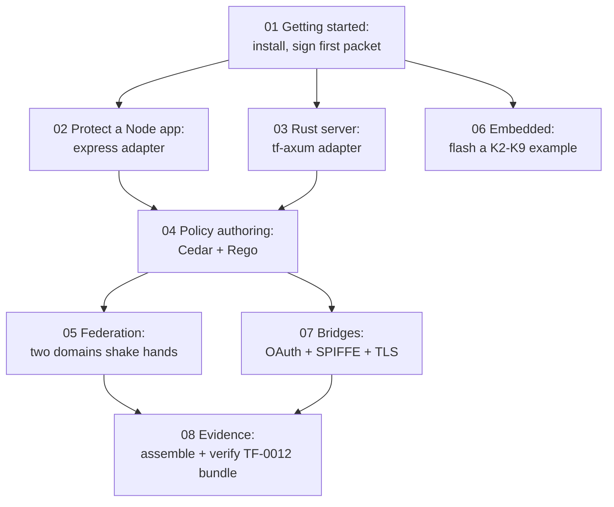

# Tutorials

Hands-on, step-by-step walkthroughs of TrustForge from the
ground up. These are ordered: each tutorial assumes you have
done the ones before it and not glossed over the boring bits.

These pages are **practical**. They contain commands you should
type and outputs you should expect. They link back to the spec
and architecture docs where appropriate but they are not
themselves spec or architecture.

If you are looking for the reference (every flag, every spec line,
every configuration knob), see [`../specs/`](../specs/) and
[`../ops/`](../ops/) instead.

## Suggested learning path

Two reasonable entry tracks:

- **Application developer** wanting to wire TrustForge into an
  existing service: 01 → (02 or 03) → 04 → 07.
- **Platform / infra engineer** wanting to run TrustForge as a
  trust fabric: 01 → 04 → 05 → 07 → 08.

Embedded engineers typically jump directly to 06 after 01.

## What each tutorial gives you

| Tutorial | You will end with |
|---|---|
| [01 Getting started](01-getting-started.md) | A running daemon, a signed `.tfpkt`, and a verified packet. |
| [02 Protect an app](02-protect-an-app.md) | An Express app with `/v1/decide` enforcement on a route. |
| [03 Rust server](03-rust-server.md) | An Axum server with `tf-axum` middleware enforcing capabilities. |
| [04 Policy authoring](04-policy-authoring.md) | A working Cedar policy and a working Rego policy, evaluated. |
| [05 Federation](05-federation.md) | Two trust domains that mutually trust each other. |
| [06 Embedded](06-embedded.md) | A LoRa or BLE node signing packets verified by your laptop. |
| [07 Bridges](07-bridges.md) | An imported OAuth credential, SPIFFE SVID, and TLS cert. |
| [08 Evidence](08-evidence.md) | A sealed, anchored `.tfbundle` you can hand to an auditor. |

## Conventions used in every tutorial

- All commands assume you are at the repo root unless a tutorial
  says `cd …` first.
- All examples use `example.com` (and `b.example` for the second
  domain in tutorial 05).
- All passwords in examples are `dev-pw`. Do not use that in
  production.
- All admin tokens in examples use
  `TF_ADMIN_TOKEN=$(openssl rand -hex 16)` per session.

## Pre-requisites for every tutorial

- Bun ≥ 1.1, Rust ≥ 1.78, Git, OpenSSL CLI.
- A POSIX shell (zsh or bash). PowerShell works but the snippets
  use bash.
- A clean checkout of TrustForge with `bun install` and
  `cargo build --workspace` already run.
- Time. Each tutorial takes 15–45 minutes; tutorial 06 takes
  longer if you have not used embedded toolchains before.

## Where to ask for help

- The `tf` CLI's `--help` output is exhaustive.
- The spec series in [`../specs/`](../specs/) is normative.
- The architecture in [`../architecture/`](../architecture/)
  explains the *why* behind each surface.
- The ops handbook in [`../ops/`](../ops/) covers production
  concerns.

If a step in a tutorial doesn't work as written, the tutorial is
wrong; please file an issue. The conformance suite catches drift
between code and spec but cannot catch drift between tutorial and
code.

## Status

Draft, like the rest of 0.1.0. Commands are accurate to the
0.1.0 reference implementation in `tools/` and `crates/`.
Outputs may differ in formatting between Bun and Rust runs; the
*content* is the contract.
